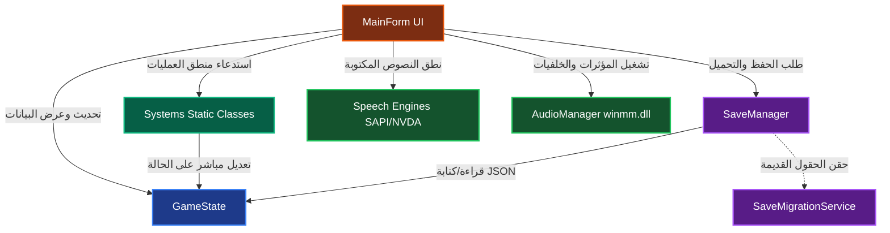

# لعبة همسات العرش (Whispers of the Throne) 👑

**همسات العرش (Whispers of the Throne)** هي لعبة تبادل أدوار وإستراتيجية عليا (Grand Strategy RPG) مصممة بالكامل لتكون متوافقة مع مكفوفي البصر (Blind-Accessible). اللعبة مستوحاة من الميكانيكيات المعقدة للعبة *Crusader Kings*، حيث يقود اللاعب سلالته الحاكمة، ويدير المقاطعات، ويقود الجيوش، ويواجه مؤامرات ودسائس البلاط الملكي في بيئة نصية وصوتية غنية مصممة خصيصاً للتوافق التام مع قارئات الشاشة (Screen Readers).

هذا المستند يمثل مرجعاً تقنياً وتصميمياً شاملاً لمطوري البرمجيات وأنظمة الذكاء الاصطناعي لفهم معمارية اللعبة وقواعدها البرمجية بالكامل لإكمالها وتطويرها في محاكيات مستقبلية أو مشاريع أخرى.

## آخر تحديثات الأنظمة

تمت إضافة حزمة استقرار وتوسيع جديدة تركز على جعل اللعبة أقرب إلى إدارة سلالية وسياسية عميقة بأسلوب مستوحى من *Crusader Kings* مع الحفاظ على قابلية الوصول الكاملة للمكفوفين.

### البطولات والمهرجانات الثقافية الكبرى

* أُضيفت إلى `GameState` خصائص جديدة: `IsTournamentActive` (افتراضي false)، `TournamentStage` (افتراضي 0؛ 0=لا شيء، 1=افتتاح، 2=فروسية، 3=مأدبة اختتام)، `TournamentDaysRemaining` (افتراضي 0)، `TournamentParticipants` كقائمة `List<string>` لمعرّفات الشخصيات المتبارية (افتراضي فارغة)، `TournamentChampionId` (افتراضي فارغ)، و`TournamentAccidentLog` كقائمة `List<string>` لتسجيل حوادث الإصابة في الدورة (افتراضي فارغة). تتم تهيئة آمنة شاملة في `ReconcileOldSaves` (تثبيت المرحلة في 0..3، تثبيت الأيام ≥ 0، تهيئة القوائم الفارغة وحماية `TournamentChampionId` من null).
* أُنشئت `Systems/TournamentSystem.cs` كمنظومة **متعددة المراحل** تُضاف إلى جانب `ActivitiesSystem.HoldGrandTournament` الموجود (الذي يبقى كما هو لتفعيل بطولة فورية +100 هيبة)، وتطبّق دورة كاملة من 3 أيام بآليات متدرجة:
    * `InitiateGrandTournament(state)` تتحقق من توفر 400 ذهب، وعدم وجود بطولة جارية (`IsTournamentActive == false`)، تخصم 400 ذهب، ترفع `RulerStress` بمقدار +40 (مُقصور عند 100)، تُضيف معدّل رأي دائم بمفتاح `AttendedRoyalTournament` وقيمة +15 لكل شخصية في `state.RealmCharacters` (باستثناء `Role == Ruler`)، تُفعّل `IsTournamentActive = true`، تعيّن `TournamentStage = 1` و`TournamentDaysRemaining = 3`، تملأ `TournamentParticipants` بما يصل إلى 6 شخصيات عشوائياً حيث `MartialSkill >= 5` (أو أي شخص بالغ `IsAdult == true` إن لم تتوفر، أو أي شخصية حية كملاذ أخير)، وتشغّل مؤثر `success` الصوتي وتُعلِن صوتياً عبر `NvdaEngine.Speak` رسالة "افتُتحت البطولة الملكية الكبرى".
    * `SimulateJoustingMatches(state)` تنتقل بالمرحلة إلى 2، تجري مباريات زوجية بين المشاركين بحيث يُحتسب `Random.Next(1, 100) + MartialSkill` لكل متنافس، ومن يحرز أعلى مجموع يتوّج بطلاً. يمنح الفائز +300 هيبة للحاكم (`state.Prestige += 300`)، يحفظ `TournamentChampionId`، يُضيف سمة دائمة `TournamentChampion` (المسمّى العربي "بطل البطولة") إلى بطل الدورة عبر `Traits`، ويُعلِن صوتياً عبر `NvdaEngine.Speak` رسالة "توج الفارس X بلقب بطل البطولة وحاز 300 هيبة" مع تشغيل مؤثر `success`.
    * `ProcessTournamentAccidents(state)` تجري فحص مخاطر عشوائي 10% (`Random.Next(100) < 10`). عند تحقق الخطر تختار أقوى فارس وأضعف فارس من المشاركين، تُضيف سمة دائمة `Mutilated` (المسمّى العربي "مشوّه") إلى الفارس الأضعف عبر `Traits` (الاتفاق: استخدام قائمة `Traits` الموجودة كحاوية للسمات الدائمة)، تستدعي `GrudgeMemorySystem.AddGrudge(state, holderId=B.Id, targetId=A.Id, grudgeType="TournamentInjury", severity=80)` لتسجيل الحقد، تُسجّل في `TournamentAccidentLog` نصاً عربياً: "أُصيب {B.Name} إصابة بالغة على يد {A.Name} في حلبة المصارعة"، وتُعلِن صوتياً عبر `NvdaEngine.Speak` رسالة "وقعت حادثة إصابة في البطولة".
    * `CompleteTournamentFeast(state)` تنتقل بالمرحلة إلى 3، تمنح +100 صيت سلالي (`state.DynastyRenown += 100`)، تعيد ضبط `IsTournamentActive = false` و`TournamentStage = 0` و`TournamentDaysRemaining = 0`، تفرغ قائمتي `TournamentParticipants` و`TournamentAccidentLog`، تُشغّل مؤثر `success` وتُعلِن صوتياً عبر `NvdaEngine.Speak` رسالة "اختُتمت البطولة الملكية الكبرى وحصدت 100 صيت سلالي"، وتُرجع `GameActionResult` بنجاح.
    * `GetTournamentReport(state)` تُرجع تقريراً نصياً عربياً متعدد الأسطر يشمل: حالة البطولة (نشطة/غير نشطة)، اسم المرحلة الحالية، الأيام المتبقية، عدد المشاركين (من 6)، اسم البطل عند توفّره، وآخر 5 إدخالات من سجل الحوادث.
* تكامل المنظومة في حلقة الزمن:
    * `CalendarTimeSystem.AdvanceDay` يُضيف بعد التكات اليومية الموجودة كتلة منطق البطولة: إذا كانت `IsTournamentActive && TournamentDaysRemaining > 0`، يخصم يوماً من العدّاد، وعند `TournamentStage == 1 && TournamentDaysRemaining == 2` يستدعي `TournamentSystem.SimulateJoustingMatches`، وعند `TournamentStage == 2 && TournamentDaysRemaining == 1` يستدعي `TournamentSystem.ProcessTournamentAccidents`، وعند `TournamentDaysRemaining == 0` يستدعي `TournamentSystem.CompleteTournamentFeast`. الأيام المهمة (التتويج والاختتام) تُسبب `ShouldPauseTime = true` لإيقاف الزمن وإعلام اللاعب.
* تكامل الواجهة:
    * أُضيفت شاشة جديدة بعنوان **"ديوان البطولات والمهرجانات الملكية الكبرى"** في قائمة الأنشطة الملكية (`ShowActivitiesMenu`) عبر زر "ديوان البطولات والمهرجانات الملكية الكبرى".
    * الشاشة تعرض حالة البطولة الحالية، المرحلة، الأيام المتبقية، عدد المشاركين، اسم البطل، وآخر 5 حوادث. تتضمّن ثلاثة أزرار `Button` مستقلة: "افتتاح البطولة الملكية الكبرى (400 ذهب)" مع `AccessibleName` وصفي كامل، "تقرير البطولة" مع `AccessibleName` يقرأ التقرير صوتياً عبر `SpeakToActiveReader`، و"العودة للأنشطة الملكية". لا رموز تعبيرية في النصوص الظاهرة.
    * تم الإبقاء على الزر القديم "إقامة بطولة فروسية كبرى (400 ذهب)" الذي يستدعي `ActivitiesSystem.HoldGrandTournament` (البطولة الفورية الأصلية) ليظلّ خياراً متاحاً للاعب.
* أُضيفت اختبارات `TournamentSystemTests` (19 اختباراً) تغطي: نجاح الافتتاح بذهب كافٍ، فشله بنقص ذهب، فشله مع بطولة جارية، خصم 400 ذهب و+40 ضغط نفسي مع تثبيت الضغط عند 100، إضافة رأي دائم +15 لجميع الشخصيات غير الحاكم، ملء المشاركين حتى 6 فرسان مؤهلين، تقدم المرحلة إلى 2 ومنح +300 هيبة في الفروسية، تعيين `TournamentChampionId` ومنح سمة البطل، إضافة حقد `TournamentInjury` عند تحقق خطر 10% (يحاول 200 مرة)، إضافة سمة `Mutilated` للضحية، اختتام المأدبة مع +100 صيت سلالي وتصفير جميع الحقول، ضبط `IsTournamentActive = false` عند الاختتام، تقرير غير فارغ، اسم البطل في التقرير، تشغيل `CalendarTimeSystem.AdvanceDay` للتسلسل متعدد المراحل كاملاً (افتتاح→فروسية→حوادث→اختتام)، منح الهيبة في يوم الفروسية، منح الصيت في اليوم الأخير، والتسلسل الآمن لجميع الحقول الجديدة في `ReconcileOldSaves`.

### الصحة العامة والأوبئة الموحدة

* أُزيلت من `Province` خصيصتا `IsInfected` و`InfectionSeverity`، وأُضيفت بدلهما قائمة `ActiveDiseases` من نوع `List<ActiveDisease>` (افتراضياً قائمة فارغة) لتمثيل جميع الأوبئة النشطة في المقاطعة دفعةً واحدة.
* أُضيف POCO جديد `ActiveDisease` في `Models/DiseaseModels.cs` يحمل: `Id` (معرّف فريد)، `Type` (اسم وباء عربي: طاعون، حمى نزفية، جدري، كوليرا، حُمَّى، سُل، إنفلونزا)، `InfectionRate` (0..100)، `MortalityRate` (0..100)، `DaysRemaining` (عداد انتهاء)، `IsQuarantined` (علم الحجر)، و`PopulationLost` (سجلّ الوفيات).
* أُزيلت من `GameState` قائمتا `ActiveDiseases` و`ActiveEpidemics` (انتقلتا إلى `Province`)، مع الإبقاء على `IsCapitalIsolated` (افتراضي false) و`DaysSinceLastOutbreak` (افتراضي 0) كحقول عامة. تتم تهيئة آمنة شاملة في `ReconcileOldSaves` (ضمان `ActiveDiseases` غير null لكل مقاطعة، تثبيت العداد إلى 0).
* أُنشئت `Systems/UnifiedHealthSystem.cs` كمنظومة **موحّدة** تحلّ محل `DiseaseSystem.cs` و`EpidemicSystem.cs` (حُذف كلاهما بالكامل):
    * `TriggerRandomOutbreak(state)` تختار مقاطعة غير محتلة عشوائياً، تُنشئ `ActiveDisease` بنوع/معدّل عدوى/معدّل وفيات عشوائي ومدة 100 يوماً، تُسجّل تحذيراً في `TurnWarnings`، تشغّل مؤثر `warning` الصوتي، وتُعلِن صوتياً عبر `NvdaEngine.Speak` رسالة تحذير.
    * `ProcessDailyHealthAndDiseases(state)` هي المحرك اليومي الموحّد: تخفّض `DaysRemaining` لكل مرض نشط، تزيل الأمراض عند بلوغ 0، تحسب وفيات يومية بناءً على `MortalityRate`×`LocalGarrison`، ثم تستدعي منطق الانتشار (5% لكل مقاطعة مصابة/يوم، سقف 4 مقاطعات مصابة، تخطّي العاصمة إذا كانت معزولة)، ثم تجري فحص إصابة الخليفة (15% احتمال لإضافة سمة "مريض" إلى `ActiveHealthTraits` وخصم 15 من `RulerHealth` فقط إذا كانت العاصمة مصابة وغير معزولة).
    * `ToggleCapitalQuarantine(state, isolate)` يرفع `IsCapitalIsolated` ويُضيف +25 إلى `RulerStress` (مُقصور عند 100) مع تحذير صوتي عبر NVDA وتشغيل مؤثر `warning`. الدالة idempotent: لا تضيف الضغط ثانية إذا كانت العاصمة معزولة مسبقاً.
    * `ShouldTriggerPeriodicOutbreak(state)` يعيد `true` عند `DaysSinceLastOutbreak >= 180` والمقاطعات المصابة أقل من 4. `TriggerPeriodicOutbreakIfNeeded(state)` يطلق تفشّياً عشوائياً ويُصفّر العداد تلقائياً.
    * `GetInfectedProvinces(state)` و`GetTotalInfectedProvinceCount(state)` و`GetHealthReport(state)` أدوات مساعدة للعرض، تجمع بين حالة الأوبئة وصحة الخليفة وقائمة المقاطعات المصابة بأسماء الأمراض ومعدّلات العدوى والوفيات والأيام المتبقية.
* تكامل المنظومة في حلقة الزمن:
    * `CalendarTimeSystem.AdvanceDay` يزيد `DaysSinceLastOutbreak` يومياً، ثم يستدعي `UnifiedHealthSystem.TriggerPeriodicOutbreakIfNeeded(state)` ليُطلق تفشياً دورياً عند بلوغ 180 يوماً ويُصفّر العداد.
    * `CalendarTimeSystem.AdvanceDay` يستدعي `UnifiedHealthSystem.ProcessDailyHealthAndDiseases(state)` بدلاً من الاستدعاءين المنفصلين السابقين.
* تكامل المنظومة في الاقتصاد الشهري:
    * `EconomySystem.ProcessMonthlyEconomy` يفحص `province.ActiveDiseases.Count > 0` بدلاً من `IsInfected`. المقاطعة المصابة تُلغى ضرائبها (مضاعف 0.0) ويُخفَّض `RecruitableLevy` إلى 20% من الأصل. يُسجّل تحذير "إغلاقات الحجر الصحي" في التقرير الشهري.
* تكامل في القوافل التجارية:
    * `TradeCaravanSystem.ProcessDailyCaravanHazards` و`RouteEncountersProvinceHazard` يفحصان `state.Provinces.Any(p => p.ActiveDiseases != null && p.ActiveDiseases.Count > 0)` بدلاً من `state.ActiveDiseases`.
* أُضيفت شاشة جديدة بعنوان **"ديوان الصحة العامة ومواجهة الأوبئة"** في بوابة الحرب والدبلوماسية (شاشة "الأوبئة والصحة")، تتضمن:
    * `ListBox` لجميع المقاطعات المصابة بصيغة "المقاطعة: {Name}، الوباء: {Type}، معدل العدوى: {InfectionRate}%, أيام متبقة: {DaysRemaining}"، يحمل `AccessibleName` و`AccessibleDescription` و`AccessibleRole` كاملين لقارئ الشاشة.
    * زرّان `Button` مستقلان بـ `AccessibleName` وصفي كامل: "فرض الحجر الصحي وإغلاق القصر" (يشرح أثر +25 ضغط نفسي والحماية من العدوى)، و"فتح الأبواب لمواساة الرعية" (يشرح تخفيف الضغط وتعريض العاصمة للعدوى). قبل كل فعل يُعلَن صوتياً عبر `SpeakToActiveReader` العواقب والآثار الجانبية.
* أُضيفت اختبارات `UnifiedHealthSystemTests` (17 اختباراً) تغطي: تعيين `ActiveDiseases` على مقاطعة عشوائية عند التفشي، تخطّي المقاطعات المحتلة، تناقص `DaysRemaining` بمقدار 1 يومياً، إزالة المرض عند بلوغ 0، انتشار العدوى لمقاطعات أخرى عبر 400 يوم، رفض إصابة العاصمة المعزولة، تأثير `ToggleCapitalQuarantine` على `IsCapitalIsolated` و`RulerStress` (+25)، idempotence الحجر، إصابة الخليفة بسمة "مريض" وخصم 15 من الصحة عند احتمال 15%، حصانة الخليفة عند العزل، إلغاء ضرائب المقاطعات المصابة، خفض التجنيد إلى 20%، التسلسل الآمن للحقول الجديدة، تشغيل التفشي الدوري عند 180 يوماً، سقف 4 مقاطعات مصابة، وحصانة العاصمة من استقبال العدوى عند العزل.

### الفعاليات والمناسبات الكبرى (ولائم وحج)

* أُضيفت خاصية `EarnedPilgrimTraits` إلى `GameState` كقائمة لحفظ السمات المكتسبة من الحج (مثل `Hajji`)، مع تهيئة آمنة في `ReconcileOldSaves`.
* أُنشئت `Systems/ActivityManagerSystem.cs` كمنظومة مستقلة للفعاليات الملكية الكبرى:
    * `HostGrandFeast(state)` تكلف 250 ذهباً، تخفض `RulerStress` بمقدار 30 فوراً، وتُضيف معدّل رأي مؤقت بمفتاح `AttendedRoyalFeast` وقيمة +20 لمدة 120 يوماً لكل شخصية في `state.RealmCharacters` عبر `OpinionSystem`.
    * `StartHolyPilgrimage(state)` تكلف 350 ذهباً، وتُنشئ `DelegatedTask` من نوع `HolyPilgrimage` مدته 60 يوماً.
    * `CompleteHolyPilgrimage(state)` تُستدعى تلقائياً عند انتهاء المهمة، فتمنح +150 تقوى، +25 شرعية دينية، تضيف `Hajji` إلى `EarnedPilgrimTraits`، وتشغّل مؤثر `success`.
* تكامل الفعاليات في حلقة الزمن:
    * `CalendarTimeSystem.ProcessDailyDelegatedTasks` يكتشف مهام `HolyPilgrimage` التي وصلت إلى `DaysRemaining == 0` ويستدعي `ActivityManagerSystem.CompleteHolyPilgrimage(state)`.
* أُضيفت شاشة جديدة بعنوان **"ديوان الفعاليات والمناسبات الكبرى"** في بوابة القصر، تتضمن:
    * زر "إقامة وليمة ملكية (250 ذهباً)" يحمل `AccessibleName` وصفي يوضح التكلفة والأثر على الضغط النفسي والرأي.
    * زر "بدء رحلة حج مقدس (350 ذهباً - 60 يوماً)" يحمل `AccessibleName` وصفي يوضح التكلفة والمدة والمكافآت الدينية.
    * قبل تنفيذ كل فعل يُعلَن صوتياً عبر `SpeakToActiveReader` حالة الذهب الكافي أو الناقص، والضغط/التقوى الحالية.
* أُضيفت اختبارات `ActivityManagerTests` تغطي: فشل الوليمة والحج بسبب نقص الذهب، خصم الذهب والضغط وتطبيق الرأي، حظر تكرار الحج، إكمال الحج ومنح سمة `Hajji`، والتسلسل الآمن لحقل `EarnedPilgrimTraits`.

### الإعمار والممتلكات الإقطاعية في المقاطعات

* أُضيفت إلى كائن `Province` خاصيتا `MarketLevel` و`BarracksLevel` افتراضياً 0، لتمثيل مستوى الأسواق والثكنات في كل مقاطعة.
* أُنشئت `Systems/InfrastructureSystem.cs` كمنظومة مستقلة للبناء والتطوير الإقطاعي:
    * `StartBuildingUpgrade(state, provinceName, buildingType)` تكلفتها `(المستوى الحالي + 1) * 150` ذهباً. تتحقق من توفر الخزينة، تخصم الذهب، وتُنشئ `DelegatedTask` من نوع `BuildUpgrade` مدته 45 يوماً، مرتبطة بالمقاطعة عبر `TargetId` ونوع المبنى عبر حقل `Tag`.
    * `CompleteBuildingUpgrade(state, provinceName, buildingType)` تُستدعى عند انتهاء المهمة: ترفع `MarketLevel` أو `BarracksLevel` بمقدار 1، وتزيد `LocalGarrison` و`RecruitableLevy` بمقدار 150 عند تطوير الثكنة، وتُسجّل إنذاراً صوتياً في `TurnWarnings`.
* تكامل المنظومة في حلقة الزمن والاقتصاد:
    * `CalendarTimeSystem.ProcessDailyDelegatedTasks` يكتشف مهام `BuildUpgrade` المكتملة ويستدعي `InfrastructureSystem.CompleteBuildingUpgrade`.
    * `EconomySystem.ProcessMonthlyEconomy` يضيف `MarketLevel * 40` ذهباً إلى الدخل الشهري الوطني لكل مقاطعة غير محتلة.
* أُضيفت شاشة جديدة بعنوان **"ديوان الإعمار وتطوير المقاطعات"** في بوابة الاقتصاد، تتضمن:
    * `ListBox` لعرض جميع المقاطعات مع مستويات السوق والثكنة، يحمل `AccessibleName` و`AccessibleDescription` و`AccessibleRole`.
    * `Label` يُحدّث تلقائياً عند تغيير الاختيار لينطق مستويات المباني الحالية، وتكلفة التطوير، ومدة البناء 45 يوماً.
    * زران `Button` مستقلان بـ `AccessibleName` وصفي كامل: "تطوير السوق" و"تطوير الثكنة".
    * قبل التنفيذ يُعلَن صوتياً عبر `SpeakToActiveReader` ما إذا كان الذهب كافياً أو ناقصاً.
* أُضيفت اختبارات `InfrastructureSystemTests` تغطي: فشل التطوير بنقص الذهب، خصم الذهب وإنشاء المهمة، تدرج التكلفة مع المستوى، حظر التطوير المزدوج، إكمال السوق والثكنة، إكمال المهمة عبر `CalendarTimeSystem.AdvanceDay`، أثر السوق على الاقتصاد الشهري، والتسلسل الآمن لـ `MarketLevel`/`BarracksLevel`.

### الوراثة الجينية للسلالة وتعليم الأبناء (نمط Crusader Kings)

* أُضيفت إلى كائن `RealmCharacter` خصائص `CharacterAge` (افتراضي 0)، و`MotherId`، و`FatherId`، و`IsAdult` (افتراضي false). كما أُضيفت `IsGenius` إلى كائن `Spouse` لدعم فحص الجينات الوراثية من جهة الأم.
* أُعيد بناء منطق الولادة داخل `DynastySystem.CreateNewborn` ليُنشئ شخصية `RealmCharacter` جديدة بـ `SourceType = "Child"` و`Role = CharacterRoleType.Child` تلقائياً:
    * إذا كان أحد الوالدين (الأم أو الأب) يحمل `IsGenius` تمنح فرصة وراثة 35%، وإذا كان كلاهما عباقرة ترتفع إلى 75%.
    * تُحفظ روابط النسب عبر `MotherId` و`FatherId`، وتُهيّأ المهارات الأولية والسمات (`ولي العهد` إن كان أول مولود).
* أُضيفت واجهات جديدة في `DynastySystem`:
    * `HandleCharacterAging(state)` تُستدعى من `AgeCharacters` لرفع `CharacterAge` لكل ابن قاصر، فإذا بلغ السادسة يُسجّل تحذير `[تعليم]` في `TurnWarnings` ويُعلَن صوتياً عبر `NvdaEngine.Speak` بضرورة اختيار توجه تعليمي. وإذا بلغ السادسة عشرة يُضبط `IsAdult = true` ويُمنح سمة مهنية دائمة بناءً على أعلى مهاراته: `MidasTouched` للإدارة، `BrilliantStrategist` للعسكري، `MasterSchemer` للدهاء، `SilverTongued` للدبلوماسية، `Erudite` للعلم.
    * `SetChildEducationFocus(state, childId, focusType)` تُعيّن `CurrentEducationFocus` للابن المختار وتمنع تعديل البالغين.
    * `ProcessMonthlyChildEducation(state)` تُستدعى شهرياً من `CalendarTimeSystem` وتطبق لفّات المهارات الشهرية للأبناء 6-15 سنة، مع ترقية `IsGenius` +20% ومضاعفة 1.5x عند وجود `CourtTutorId` نشط. المهارة المستهدفة تأخذ مكافأة إضافية إذا كانت مهارة المؤدّب (التعلم/الإدارة) تتجاوز 10.
* أُضيفت شاشة جديدة بعنوان **"ديوان تربية وتعليم أبناء السلالة"** في القصر الحاكم، تتضمن:
    * `ListBox` لعرض الأبناء القاصرين (6-15) مع `AccessibleName` و`AccessibleDescription` و`AccessibleRole` ينطق العمر، المهارات، والتوجه الحالي.
    * `Label` ديناميكي يُحدّث عند تغيير الاختيار ليعرض تفاصيل الابن المختار وحالته العبقرية.
    * خمسة أزرار `Button` مستقلة لتحديد التوجه: عسكري، إدارة واقتصاد، دهاء ومكائد، دبلوماسية، علم وثقافة. كل زر يحمل `AccessibleName` وصفي كامل.
* أُضيفت اختبارات `DynasticGeneticsTests` تغطي: إنشاء شخصية ابن جديدة مع الحقول الجديدة، وراثة العبقرية من أحد الوالدين أو كليهما (35%/75%)، عدم الوراثة من أبوين عاديين، تعيين التوجه التعليمي ومنع تعديل البالغين، تحذير بلوغ السادسة، البلوغ عند السادسة عشرة ومنح السمات المهنية، تطور المهارات الشهرية، تصفية الأبناء حسب العمر، والتسلسل الآمن لجميع الحقول الجديدة في `GameState`.

### القوافل التجارية وطريق الحرير (نمط Crusader Kings)

* أُضيفت إلى `GameState` خصائص `IsCaravanActive`، و`ActiveCaravanLeaderId`، و`CaravanHazardPenalty` (افتراضي 0) مع تهيئة آمنة في `ReconcileOldSaves`.
* أُنشئت `Systems/TradeCaravanSystem.cs` كمنظومة مستقلة لتسيير القوافل:
    * `LaunchCaravan(state, leaderId, goldInvestment)` تتحقق من توفر الذهب (100/300/500)، ومن عدم وجود قافلة نشطة، ومن أن القائد المختار بالغ وغير مشغول في بعثة. تخصم الذهب، تُفعّل `IsCaravanActive`، تُعيّن القائد، تضعه في `IsAwayOnExpedition`، وتنشئ `DelegatedTask` من نوع `TradeCaravan Route` مدته 60 يوماً يحفظ `GoldCost` كمستوى استثمار و`TargetId` كمعرّف القائد.
    * `CompleteCaravanRoute(state, investmentTier, leaderId)` تُستدعى عند انتهاء المهمة: تخصم عقوبات المخاطر المتراكمة (`CaravanHazardPenalty`) من الاستثمار الفعلي، تحتسب الربح كـ `الاستثمار_الفعلي * 2.5 + (StewardshipSkill * الاستثمار_الفعلي / 50)`، تضيف الربح إلى الخزينة، ترفع `MarketLevel` للعاصمة (بغداد) بمقدار 1، تستدعي القائد من بعثته، وتُشغّل مؤثر `success` الصوتي.
    * `ProcessDailyCaravanHazards(state)` تُستدعى من `CalendarTimeSystem.AdvanceDay` يومياً. تجري فحص مخاطر عشوائي 2% فقط إذا كانت القافلة نشطة، وتفحص وجود أوبئة نشطة أو حروب جارية (`ActiveDiseases`/`ActiveWar`). عند تحقق الخطر تتراكم العقوبة 15% من الاستثمار الأصلي في `CaravanHazardPenalty` ويُسجّل تحذير في `TurnWarnings`.
* تكامل في حلقة الزمن:
    * `CalendarTimeSystem.ProcessDailyDelegatedTasks` يكتشف مهام `TradeCaravan Route` المكتملة ويستدعي `TradeCaravanSystem.CompleteCaravanRoute` مع تمرير `t.GoldCost` كمستوى استثمار.
* أُضيفت شاشة جديدة بعنوان **"ديوان تسيير القوافل وطرق الحرير التجارية"** في بوابة الاقتصاد، تتضمن:
    * `ListBox` لاختيار القائد من الشخصيات البالغة المتاحة مع `AccessibleName` و`AccessibleDescription` و`AccessibleRole` ينطق اسم القائد ومهاراته الإدارية والعسكرية.
    * `Label` ديناميكي يُحدّث عند تغيير الاختيار ليلعلن العائد المتوقع بناءً على مهارات القائد، وحالة الطرق من حيث الأوبئة والحروب.
    * ثلاثة أزرار `Button` لمستويات الاستثمار (100/300/500) كل واحد يحمل `AccessibleName` وصفي كامل يوضح التكلفة والمدة 60 يوماً.
    * قبل الإطلاق يُعلَن صوتياً عبر `SpeakToActiveReader` حالة الذهب الكافي أو الناقص.
* أُضيفت اختبارات `TradeCaravanSystemTests` تغطي: فشل الإطلاق بنقص الذهب أو استثمار غير صالح أو قائد مفقود، خصم الذهب وتعيين القائد، حظر القوافل المزدوجة، إكمال القافلة ومنح الربح ورفع السوق، تطبيق عقوبة المخاطر، تراكم المخاطر عند وجود وباء، عدم تراكم العقوبة في الطرق الآمنة، إكمال القافلة عبر `CalendarTimeSystem.AdvanceDay`، كشف المخاطر من الأوبئة والحروب، والتسلسل الآمن لحقول القافلة.

### العقود الإقطاعية وسحب الألقاب (نمط Crusader Kings)

* أُضيفت إلى كائن `RealmCharacter` خصائص `TaxObligationTier` (0: منخفض، 1: عادي، 2: مرتفع) و`LevyObligationTier` (0..2) كلتاهما افتراضياً 1. كما أُضيفت `BaseRecruitableLevy` إلى كائن `Province` لتخزين الأساس الديموغرافي للتجنيد قبل تطبيق مضاعف العقد (مُهيّأ في `ReconcileOldSaves`).
* أُنشئت `Systems/FeudalContractSystem.cs` كمنظومة مستقلة للتفاوض على العقود وسحب الألقاب:
    * `ModifyContract(state, characterId, newTaxTier, newLevyTier, useHook)` تُعيّن المستويين الجديدين. إذا كان التعديل تصاعدياً (يرفع الضريبة أو الخدمة) دون `useHook`، تستدعي `TyrannySystem.AddTyranny(state, 10)` وتُطبّق معدّل رأي دائم `-30` بمفتاح `ForcedHarshContract` على الوالي المستهدف. مع `useHook` أو عند خفض المستويات، لا تُفرض عقوبات.
    * `RevokeProvinceTitle(state, characterId, provinceName)` تتحقق من هوية الوالي والمقاطعة. إذا كان `IsPrisoner == true` أو `FactionProgress > 50` (متمرد) يكون السحب مشروعاً: تُعيد المقاطعة للخليفة (`Vassal = RulerName`، `GovernorId = ""`)، تُصفّر مقاييس العقد إلى 1، تُضيف `+10` رعباً صافياً، وتمسح `FactionProgress`. إذا كان بريئاً: `AddTyranny(25)`، تُطبّق `ArbitraryTyrant -20` رأياً دائماً على كل الولاة الآخرين، وترفع `FactionProgress` للضحية إلى 100 (دخول تمرد مفتوح).
* تكامل في الاقتصاد الشهري:
    * `EconomySystem.ProcessMonthlyEconomy` تبحث عن الوالي المرتبط بالمقاطعة (`RealmCharacter.SourceId == province.GovernorId`) وتستخرج `TaxObligationTier` و`LevyObligationTier`. تُطبّق مضاعف 0.6/1.0/1.4 على دخل المقاطعة (`province.Income` ودخل السوق) وعلى `RecruitableLevy` (مُعاد حسابه من `BaseRecruitableLevy` لمنع التراكم).
* أُضيفت شاشة جديدة بعنوان **"ديوان العقود الإقطاعية وسحب الألقاب"** في بوابة الشؤون السياسية، تتضمن:
    * `ListBox` لجميع الولاة (`SourceType == "Governor"`) مع `AccessibleName` و`AccessibleDescription` ينطق اسم الوالي، مستويات العقد، والمقاطعات التي يحكمها.
    * `Label` ديناميكي يُحدّث عند تغيير الاختيار ليلعلن الحالة القانونية للوالي (سجين / متمرد / بريء) ومستويات العقد والمقاطعات.
    * زرّان `Button` مستقلان بـ `AccessibleName` وصفي كامل: "تعديل شروط العقد الإقطاعي" (يفرض تصعيداً إلى المستوى 2 كاختبار)، و"تجريد الوالي وسحب اللقب والمقاطعة" (يشرح تكلفة الطغيان والرأي لكل من البريء والمذنب).
* أُضيفت اختبارات `FeudalContractSystemTests` تغطي: المستويات الافتراضية، تصعيد العقد بدون خطاف يطبق الطغيان والمعدّل، تصعيد بخطاف يتجاوز العقوبات، خفض العقد بدون عقوبات، رفض المستويات غير الصالحة، سحب اللقب من بريء (طغيان + رأي عام + تمرد)، سحب من سجين (رعب فقط)، سحب من متمرد (مشروع)، إعادة مستويات العقد إلى الطبيعي بعد السحب، مضاعفات الضريبة (0.6/1.0/1.4)، تطبيق مضاعف الضريبة المرتفع على الدخل، تطبيق مضاعف الخدمة المرتفع على التجنيد، تطبيق مضاعف الضريبة المنخفض، المقاطعات المملوكة، والتسلسل الآمن للمستويات و`BaseRecruitableLevy`.

### المكائد النشطة وتلفيق الأسرار (نمط Crusader Kings)

* أُضيفت إلى `GameState` خصائص `ActiveSchemeType` (افتراضي "None") و`ActiveSchemeTargetId` (افتراضي "") مع تهيئة آمنة في `ReconcileOldSaves`.
* أُنشئت `Systems/IntrigueSchemeSystem.cs` كمنظومة مستقلة للمكائد السرية:
    * `LaunchScheme(state, targetId, schemeType)` تتحقق من نوع المكيدة (`Murder` أو `FabricateSecret`)، ومن عدم وجود مكيدة نشطة، ومن وجود الهدف. تُعيّن `ActiveSchemeType`/`ActiveSchemeTargetId`، وتُنشئ `DelegatedTask` من نوع `ActiveIntrigueScheme` مدته 90 يوماً يحفظ الهدف في `TargetId` ونسبة النجاح المحسوبة في `EffectValue`.
    * `ResolveSchemeOutcome(state, targetId, schemeType)` تُستدعى عند انتهاء المهمة. تحتسب نسبة النجاح: `45 + (Spymaster.IntrigueSkill * 3) - (Target.IntrigueSkill * 2) - 25` إذا كان `BodyguardId` أو `FoodTasterId` نشطاً (مقصوص بين 0..100). النجاح في `FabricateSecret` يُنشئ `PoliticalHook` قوي دائم 5 سنوات و`CharacterSecret` مكشوف، ويُشغّل مؤثر `success`. النجاح في `Murder` يُعلّم `IsDead=true` على الهدف، يُفرغ مقعده في `Council`، ويُسقط مقاطعته للخليفة. الفشل يُضيف `+20` طغياناً ويستدعي `GrudgeMemorySystem.AddGrudge` على الولي الأساسي للضحية بنوع `Betrayed` وشدة 80. ثم تُمحى `ActiveSchemeType`/`ActiveSchemeTargetId`.
    * `CalculateSuccessChance(state, target)` يكشف المعادلة للواجهة وقارئ الشاشة.
* تكامل في حلقة الزمن:
    * `CalendarTimeSystem.ProcessDailyDelegatedTasks` يكتشف مهام `ActiveIntrigueScheme` المكتملة ويستدعي `IntrigueSchemeSystem.ResolveSchemeOutcome` باستخدام `state.ActiveSchemeType`.
* أُضيفت شاشة جديدة بعنوان **"ديوان الحياكة والمكائد السرية"** في بوابة الاستخبارات الملكية، تتضمن:
    * `ListBox` لجميع الشخصيات الحية القابلة للاستهداف (باستثناء مدير المخابرات) مع `AccessibleName` و`AccessibleDescription` و`AccessibleRole` ينطق الاسم ومهارة الدهاء.
    * `Label` ديناميكي يُحدّث عند تغيير الاختيار ليلعلن نسبة النجاح الأساسية المحسوبة وحالة حماية القصر.
    * زرّان `Button` مستقلان بـ `AccessibleName` وصفي كامل: "بدء مكيدة اغتيال سري" و"بدء مكيدة تلفيق سر سياسي" مع شرح كامل للمعادلة والمدة 90 يوماً.
    * قبل الإطلاق يُعلَن صوتياً عبر `SpeakToActiveReader` حالة المكيدة النشطة وحالة الحماية.
* أُضيفت اختبارات `IntrigueSchemeSystemTests` تغطي: رفض إطلاق مكيدة نشطة، رفض نوع غير صالح، رفض هدف مفقود/متوفى، تعيين الحالة وإنشاء المهمة، معادلة نسبة النجاح، خصم حماية القصر (`BodyguardId`/`FoodTasterId`)، إكمال المكيدة عبر `CalendarTimeSystem.AdvanceDay` مع تحقق فعلي من إنشاء `PoliticalHook`، فشل يطبق الطغيان ويسجل حقداً، نجاح اغتيال يُعلّم الهدف ميتاً ويُفرغ مقعده، استثناء الأموات ومدير المخابرات من قائمة الأهداف، والتسلسل الآمن لحقول المكيدة.

### محرّك إنذارات الفصائل والحرب الأهلية (نمط Crusader Kings)

> **ملاحظة:** كان لدى `FactionSystem.cs` حلقة إنذار/تمرد أساسية (إنذار 7-14 يوم، رفض/قبول/رشوة، جيوش متمردة في `EnemyArmies`، قمع عبر `WarfareSystem.SuppressRebelArmy`). الـ`FactionWarEngine` الجديد يُكمل هذا النظام بـ **حالة حرب أهلية صريحة** (`IsCivilWarActive`/`RebelVassalIds`)، **توقف الزمن** عند الإنذار، **`CrownAuthorityLevel` كعملة سياسية**، **نقل تلقائي للسجن عند النصر**، و **abdication عند الهزيمة**.

* أُضيفت إلى `GameState` خصائص `IsCivilWarActive` (افتراضي false) و`RebelVassalIds` (افتراضي قائمة فارغة) و`InitialRoyalArmySnapshot` (افتراضي 0) مع تهيئة آمنة في `ReconcileOldSaves`.
* أُنشئت `Systems/FactionWarEngine.cs` كمنظومة مستقلة لإنذارات الفصائل والحرب الأهلية:
    * `TriggerFactionUltimatum(state)` تُستدعى فوراً عند بلوغ `FactionProgress` إلى 100%. تُوقف الزمن (`state.Time.IsPaused = true`)، تُسجّل تحذيراً `[حرب أهلية]` في `TurnWarnings`، وتُنشئ حدثاً في `DynastyChronicle`. لا تعمل إذا كانت الحرب الأهلية جارية بالفعل (idempotent).
    * `AcceptUltimatumDemands(state)` تتحقق من توفر 300 ذهب، تخصمها، تُخفّض `CrownAuthorityLevel` بمقدار مستوى واحد (لا تنخفض تحت `Low`)، تُصفّر `FactionProgress` لجميع الشخصيات وتُخفّض `Discontent` للفواصل، ثم تستأنف الزمن.
    * `RefuseUltimatumAndStartCivilWar(state)` تُفعّل `IsCivilWarActive`، تجمع كل الولاة الأحياء ذوي الرأي < `-30` في `RebelVassalIds`، تستدعي `EconomySystem.MobilizeArmy` على مقاطعة كل متمرد (تعبئة رمزية)، وتضيف جيشاً معارضاً في `state.EnemyArmies` بمعرّف `"rebel_army_..."`. تضع علامة `Occupied=true` و`OccupiedBy="المتمردون"` على المقاطعة (يستثنيها `ProcessMonthlyEconomy` من الضرائب تلقائياً). تُلتقط لقطة للجيش الملكي (`InitialRoyalArmySnapshot`).
    * `CheckCivilWarResolution(state)` تُستدعى يومياً من `CalendarTimeSystem.AdvanceDay`:
        - **النصر الملكي** (لا جيوش متمردة متبقية): تُعلّم `IsCivilWarActive=false`، تُفرّغ `RebelVassalIds`، تنقل كل المتمردين إلى `state.DungeonPrisoners` و`state.Prisoners` كـ `RebelGovernor`، تضع علامات `IsPrisoner=true` وسمات `خائن` و`TreasonFlag`، تُصفّر `FactionProgress` وتُسقط مهام المجلس. تُشغّل `success`.
        - **النصر المتمرد** (الجيش الملكي = 0): تضبط `RulerIsDead=true`، تخصم 500 هيبة، تُصفّر فهارس الفصائل، وتستدعي `SuccessionLawSystem.ExecuteSuccessionLaw` فوراً (abdication).
    * مساعدات: `GetRebelArmySize`، `GetRoyalArmySize`، `IsRebelArmy`، `RebelOpinionThreshold=-30`، `UltimatumGoldCost=300`، `PrestigeLossOnRebelVictory=500`.
* تكامل في حلقة الزمن:
    * `CalendarTimeSystem.AdvanceDay` بعد `FactionSystem.ProcessDailyFactions`: إذا رجعت النتيجة بفقرة "إنذار" ولم تكن `IsCivilWarActive`، تُستدعى `FactionWarEngine.TriggerFactionUltimatum(state)`. إذا كانت `IsCivilWarActive`، تُستدعى `FactionWarEngine.CheckCivilWarResolution(state)`.
    * `EconomySystem.ProcessMonthlyEconomy` يتخطى المقاطعات التي `Occupied=true` (مما يستثني المقاطعات المتمرضة من الضرائب).
* أُضيفت نافذة منبثقة جديدة `ShowFactionUltimatumPanel` كتلة حوارية (`Form` modal) مع `AccessibleRole=Dialog`، تتضمن:
    * `Label` يعرض تفاصيل الإنذار: التكلفة السياسية (300 ذهب + خفض `CrownAuthority`)، حجم الجيش المعارض التقديري، حجم الجيش الملكي، عواقب الفشل.
    * زرّان `Button` مع `AccessibleName` وصفي كامل: "الموافقة على شروط الثوار وتجنب الحرب" و"رفض الإنذار ورفع راية الحرب الأهلية" + زر "تأجيل القرار".
    * مفاتيح `AcceptButton`/`CancelButton` للتنقل بلوحة المفاتيح.
    * زر "الحرب الأهلية جارية" في `ShowPoliticalAffairsMenu` أثناء الحرب، مع `ShowCivilWarStatus` يعرض الجيوش المتمردة.
    * زر اختبار "محاكاة إنذار فصيل" لاستدعاء `TriggerFactionUltimatum` يدوياً.
* أُضيفت اختبارات `FactionWarEngineTests` تغطي: تشغيل الإنذار يوقف الزمن ويُسجّل التحذير، idempotency أثناء الحرب الأهلية، رفض القبول بنقص الذهب، القبول يخفض الذهب و`CrownAuthority` ويصفّر التقدم، `CrownAuthority` لا ينخفض تحت `Low`، الرفض يفعّل `IsCivilWarActive` ويجمع المتمردين ويضع علامات `Occupied`، الرفض يستدعي `MobilizeArmy` ويُنشئ جيشاً معارضاً، النصر الملكي يسجن المتمردين ويفرغ `RebelVassalIds` ويضع سمات الخيانة، النصر المتمرد يُسقط `RulerIsDead` ويُنفّذ `ExecuteSuccessionLaw`، حجم الجيش المعارض/الملكي، تشغيل الإنذار عبر `CalendarTimeSystem.AdvanceDay`، والتسلسل الآمن للحقول الجديدة.

### خزانة المقتنيات والآثار الملكية (نمط Crusader Kings)

> **ملاحظة:** كان لدى `HonorArtifactSystem.cs` نظام اقتناء تحف فوري بـ 4 أزرار شراء بـ 200-500 ذهب. الـ`ArtifactSystem` الجديد يضيف نظام **فتحات装备 (Weapon/Robe/Book)** مع **BuffType (Martial/Piety/Opinion)** و**BuffValue**، ومعدّات装备 (`EquippedWeapon/Robe/Book`)، و**مهمة مفوّضة لمدة 45 يوماً** لجلب تحفة عشوائية، وتكامل مباشر مع `CombatSystem` و`CalendarTimeSystem` و`OpinionSystem`.

* أُضيفت إلى `Artifact` (في `HonorModels.cs`) خصائص `SlotType` ("Weapon"/"Robe"/"Book") و`BuffType` ("Martial"/"Piety"/"Opinion") و`BuffValue` (افتراضي 0).
* أُضيفت إلى `GameState` خصائص `TreasuryInventory` (افتراضي قائمة فارغة) و`EquippedWeapon` و`EquippedRobe` و`EquippedBook` (افتراضي null).
* أُنشئت `Systems/ArtifactSystem.cs` كمنظومة装备:
    * `EquipArtifact(state, artifact)` يُعيّن الأثر إلى فتحة المقابلة بناءً على `SlotType` ويضع علامة `IsEquipped` ضمنياً.
    * `FundArtifactExpedition(state)` يتحقق من 300 ذهب، يخصمها، ويُنشئ `DelegatedTask` من نوع `ArtifactExpedition` مدته 45 يوماً.
    * `CompleteArtifactExpedition(state)` يُستدعى عند انتهاء المهمة: ينشئ أثراً عشوائياً (Slot/Buff/Value من 5..20)، يضيفه إلى `TreasuryInventory`، يُسجّل في `TurnWarnings` و`DynastyChronicle`، ويُشغّل `success`.
    * مساعدات: `GetWeaponAdvantageBonus`، `GetBookPietyBonus`، `GetRobeOpinionBonus`، `GetUnequippedTreasuryItems`، `GetArtifactSlotArabic`، `GetBuffTypeArabic`.
* تكامل buff:
    * `CombatSystem.RunMainClashPhase`: إذا كان `EquippedWeapon` نشطاً و`BuffType=Martial`، يُضاف `BuffValue` إلى ميزة قائد المهاجم. يُسجّل سطر "[أثر السلاح]" في سجلات المرحلة.
    * `CalendarTimeSystem` الحلقة الشهرية: إذا كان `EquippedBook` نشطاً و`BuffType=Piety`، يزداد `state.Piety` بمقدار `BuffValue` في نهاية الشهر، ويُسجّل تحذير "[آثار]".
    * `OpinionSystem` + `ArtifactSystem.RecalibrateOpinionBuff`: تجهيز رداء `BuffType=Opinion` يضع معدّل رأي دائم `RoyalRobePrestige` على جميع الشخصيات غير الخليفة. هذا يُحتسب في `GetTotalOpinion` تلقائياً.
* أُضيفت شاشة جديدة `ShowTreasuryInventoryMenu` في بوابة القصر الحاكم، تتضمن:
    * `Label` يعرض فتحات装备 النشطة (سلاح/رداء/كتاب) مع نوع وقيمة المكافأة.
    * زر "تمويل بعثة اقتناء أثر ملكي (300 ذهب - 45 يوماً)" يتحقق من الذهب قبل التشغيل.
    * `ListBox` للآثار غير装备ة مع `AccessibleName` و`AccessibleDescription` ينطق الاسم والفتحة والمكافأة.
    * زر "تجهيز وارتداء الأثر الملكي" مع `AccessibleName` وصفي كامل.
* أُضيفت اختبارات `ArtifactSystemTests` تغطي:装备 إلى الفتحة الصحيحة، buff القائد، buff التقوى الشهرية، buff الرأي الدائم، استبدال الرداء يحدّث المعدّل، رفض التمويل بنقص الذهب، إنشاء المهمة، إكمال المهمة يُنشئ أثراً عشوائياً، إكمال عبر `CalendarTimeSystem.AdvanceDay`، الأثر المجهّز يُحرّك CombatSystem، التسلسل الآمن لـ `EquippedWeapon/Robe/Book` و`TreasuryInventory`.

### الفيالق المأجورة والتعبئة الطارئة (نمط Crusader Kings)

* أُضيفت إلى `MercenaryCompany` (في `MercenaryModels.cs`) خصائص `CompanyName` (alias لـ `HistoricalName`)، `GoldCost` (alias لـ `MonthlyCost`)، `ContractDurationDays`، `ArchersCount`، `HeavyInfantryCount`. الحقول القديمة (`Soldiers/MonthlyCost/Loyalty/DaysUntilDeparture`...) مُحافَظ عليها للتوافق العكسي مع `SaveManager`.
* أُضيفت إلى `GameState` خاصية `AvailableMercenaries` (افتراضي null، تُملأ في `ReconcileOldSaves`).
* أُنشئت `Systems/MercenarySystem.cs` بالمواصفات المطلوبة:
    * `InitializeDefaultMercenaries(state)` يُنشئ 6 فيالق تاريخية افتراضية (رماة الديلم، فرسان خراسان، فرقة الصقالبة، سيوف الترك، كتيبة الأرمن، درع الحجاز) مع `GoldCost` (450-800) و`ArchersCount`/`HeavyInfantryCount` (0-250).
    * `HireMercenaryCompany(state, companyName)` يتحقق من `state.Gold >= GoldCost`، يخصمها، يضبط `IsHired=true` و`ContractDurationDays=1080`، ويحقن `ArchersCount`/`HeavyInfantryCount` في جيش العاصمة (ينشئ جيشاً جديداً إذا لم يوجد). يُشغّل `success`.
    * `ProcessMercenaryContractExpirations(state)` يُستدعى يومياً من `CalendarTimeSystem.AdvanceDay`: يخصم يوماً من كل عقد نشط. عند بلوغ `0`، يتحقق من الذهب: إن كفى (50% من `GoldCost`)، يجدد العقد تلقائياً ويُسجّل تحذير. وإلا، ينسحب `ArchersCount`/`HeavyInfantryCount` من الجيش (باستخدام `Math.Min` لمنع الـ underflow)، يُسقط `IsHired`، ويُعلن صوتياً عبر `NvdaEngine.Speak`.
    * مساعدات: `GetAvailableHirePool`، `GetActiveContracts`، `GetExtensionFee` (50% من `GoldCost`).
* تكامل في حلقة الزمن:
    * `CalendarTimeSystem.AdvanceDay` يستدعي `MercenarySystem.ProcessMercenaryContractExpirations(state)` كل يوم.
* أُضيفت شاشة `ShowNewMercenaryDiwanMenu` في بوابة الحرب والدبلوماسية، تتضمن:
    * `Label` يعرض العقود النشطة (الاسم + الأيام المتبقية) والذهب المتاح.
    * `ListBox` لجميع الفيالق المتاحة مع `AccessibleName` ينطق الاسم، التكلفة، عدد الرماة، والمشاة الثقيلة.
    * `Label` ديناميكي يُحدّث عند تغيير الاختيار ليلعلن تفاصيل التكلفة ورسوم التجديد.
    * زر "توقيع عقد الفيلق العسكري (أجل 3 سنوات)" مع `AccessibleName` وصفي كامل.
* أُضيفت اختبارات `NewMercenarySystemTests` تغطي: التهيئة الافتراضية، رفض بنقص ذهب، رفض شركة مفقودة، التوظيف يخصم الذهب ويضبط `ContractDurationDays`، التوظيف يمنع التكرار، التوظيف يحقن في الجيش، انتهاء العقد يخصم يوماً، التجديد التلقائي عند توفر الذهب، الانسحاب عند انتهاء العقد، رسم التجديد = 50% من `GoldCost`، الاستدعاء من `CalendarTimeSystem.AdvanceDay`، تصفية القوائم، والتسلسل الآمن للحقول الجديدة.

### الانهيارات النفسية وآليات التأقلم للضغط

* أُضيفت خصائص `ActiveStressLevel` (0..3) و`CopingTraits` (قائمة) إلى `GameState`، مع تثبيت آمن في `ReconcileOldSaves` للقيم خارج النطاق.
* أُنشئت `Systems/StressSystem.cs` كمنظومة مستقلة لإدارة الضغط النفسي للخليفة:
    * `AddStress(state, value)` يَزيد `RulerStress` ضمن النطاق 0..100. يفحص العتبات بعد كل زيادة: `>= 40` يُفعّل المستوى 1، `>= 70` يُفعّل المستوى 2، `>= 100` يُشغّل الانهيار القاتل (السكتة القلبية) ويُفعّل `SuccessionLawSystem.ExecuteSuccessionLaw` تلقائياً.
    * `TriggerFatalCollapse` داخلياً يضبط `RulerHealth = 0`، و`RulerIsDead = true`، ويُسجّل تحذير "[سكتة قلبية]:" الصوتي في `TurnWarnings`.
    * `ProcessMonthlyStressDecay` يُستدعى من `CalendarTimeSystem.AdvanceDay` شهرياً: يَخصم 5 نقاط إذا كانت `Recluse` في `CopingTraits`، و3 نقاط إذا كانت `Irritable`، ويُصفّر `ActiveStressLevel` إلى 0 إذا نزل الضغط دون 40.
    * `AdoptCopingMechanism(state, traitName)` يخصم 30 نقطة ضغط فورياً، يُضيف السمة إلى `CopingTraits`، ويُطبّق تعديلات إحصائية فورية (مثل Recluse تُخفض الهيبة 5 والرضا 3، Irritable تُخفض الشرعية 5 وترفع الرعب 10، Profligate تخصم 100 ذهب، Just ترفع الرضا 10 والشرعية 5).
* تكامَل التأثير على باقي الأنظمة:
    * `StressSystem.GetChancellorSkillPenalty(state)` يُعيد `-4` إذا كانت `Recluse` نشطة (للاستخدام في حسابات دبلوماسية الصدر).
    * `StressSystem.GetVassalOpinionPenalty(state)` يُعيد `-15` إذا كانت `Irritable` نشطة (للاستخدام في حسابات رأي الولاة عبر `OpinionSystem`).
* أُضيفت شاشة جديدة بعنوان **"الضغط النفسي وآليات التأقلم"** في بوابة القصر، تتضمن:
    * أربعة أزرار لتبني السمات المتاحة: `Recluse`، `Irritable`، `Profligate`، و`Just`، كل زر يحمل `AccessibleName` وصفي كامل.
    * زر "اختبار رفع الضغط لاختبار الانهيار (إضافة 60)" لإثارة النوبة يدوياً.
    * زر "إطلاق نوبة الانهيار يدوياً" لاستدعاء `TriggerMentalBreakPopup`.
* أُضيفت `MainForm.TriggerMentalBreakPopup(state, level)` كنافذة منبثقة معيارية (modal `Form`) تَستخدِم `AccessibleName` و`AccessibleRole = Dialog`، وتعرض:
    * ترويسة بمستوى الإرهاق الحالي والضغط النفسي.
    * زرَّيْن وصفيين قابلَين للوصول الكامل: "تبني الانعزال التام (-30 ضغط، -4 دبلوماسية)" و"تبني السلوك الحاد والغاضب (-30 ضغط، -15 علاقات مع الولاة)"، كل واحد مع `AccessibleName` و`AccessibleDescription` لقارئ الشاشة.
    * زر "تأجيل القرار" مع رسالة إلغاء قياسية.
    * عند المستوى 3 (السكتة القلبية)، يُعرض `MessageBox` صريح يفيد بوفاة الخليفة الحتمية.

### الحروب المقدسة والجهاد الكبير والحماس الديني

* أُضيفت إلى `GameState` خصائص: `ReligiousFervor` (0..100، افتراضي 50)، و`IsGreatJihadActive` (boolean، افتراضي false)، و`GreatJihadDaysRemaining` (int، افتراضي 0). تم ضمان القيم في `ReconcileOldSaves` (تثبيت 0..100 للفيرفور، و0 للأيام المتبقية).
* أُضيفت `DiplomacySystem.DeclareHolyWar`:
    * يتحقق من عدم وجود حرب جارية، ومن عدم تحالف اللاعب مع الهدف، ومن اختلاف المذهب (`FaithSystem.IsSameReligionAsPlayer`).
    * يكلف 150 تقوى (وليست هيبة) ويبدأ حرباً من نوع `HolyWar` على أول مقاطعة قابلة للضم.
    * عند النجاح: +5 حماس ديني، +10 شرعية، يضيف تحذير صوتي في `TurnWarnings`، ويُسجّل `[حرب مقدسة]:` كرسالة.
* أُنشئت `Systems/FaithSystem.cs` كمنظومة مستقلة للجهاد والحماس الديني:
    * `TriggerGreatJihad` يُفعَّل فقط إذا كانت `ReligiousLegitimacy < 50` أو كانت هناك حرب جارية في مقاطعة رئيسية. عند التفعيل: `IsGreatJihadActive = true`، و`GreatJihadDaysRemaining = 120`، و`ReligiousFervor = 100`، و+10 شرعية.
    * يستخرج **30%** من رِمالة (`LeviesCount`) كل شخصية `Governor` ويُضيفها إلى الجيش الملكي مباشرةً.
    * يجمد `FactionProgress` ويصفّر `IsPreparingRebellion` للفصائل النشطة.
    * يُشغّل `AudioManager.Play("success")` ويُرسل نداءً صوتياً عبر `NvdaEngine.Speak` ("أيها المسلمون، أُعلن الجهاد الكبير دفاعاً عن الملة!").
    * `ProcessDailyGreatJihad` يُستدعى من `CalendarTimeSystem.AdvanceDay` يومياً، يخصم يوماً من العداد، وعندما يصل 0 يُلغي التفعيل ويزيل تجميد الفصائل.
* تكامَل الحماس الديني في المعارك:
    * `CombatSystem.SiegeStorm` يطبّق `FaithSystem.GetFervorDamageMultiplier` على `effectiveArmy` (x1.15 إذا >70، x0.85 إذا <30).
    * `CombatSystem.RunMainClashPhase` يضيف `FaithSystem.GetFervorMoraleModifier` (+15 أو -15) لميزة القائد، ويسجل سطر "[مرحلة الصدام الرئيسي]: أثر الحماس الديني" في السجلات.
* أُضيفت شاشة جديدة بعنوان **"ديوان الشؤون الدينية والجهاد المقدس"** في بوابة القصر:
    * `ListBox` لجميع الدول المجاورة مع وسم `[نفس المذهب]`/`[مذهب مختلف]` و`AccessibleName`/`AccessibleDescription` لقارئات الشاشة.
    * زرّان `Button` مستقلان، كل واحد يحمل `AccessibleName` وصفي كامل:
        - "إعلان حرب مقدسة للتوسع العسكري" (يكلف 150 تقوى).
        - "إعلان النفير العام والجهاد الكبير" (يكلف 120 يوماً من التعبئة العامة).
    * قبل تنفيذ أي فعل، يُسجَّل صوتياً عبر `SpeakToActiveReader` ما إذا كانت الدولة مختلِفة المذهب، أو التقوى كافية، أو الجهاد مُفعَّل، لتوجيه قرار اللاعب الكفيف.

### ديوان المصاهرات والتحالفات السياسية

* أُضيفت خاصية `TargetId` على `DiplomaticTreaty` كـ wrapper آمن يُعيد/يكتب `KingdomBId`، فيتم تسلسلها وتنسيقها بسلاسة في JSON دون التأثير على المحفوظات القديمة.
* أُضيفت دالة `GameState.IsAlliedWith(string targetId)` التي تفحص وجود معاهدة نشطة من نوع `Alliance` أو `DefensiveAlliance` أو `OffensiveAlliance` أو `MarriageAlliance` ضمن تاريخ انتهاء مستقبلي، وتُستخدم في كل من الحرب والقتال.
* أُنشئت `Systems/AllianceSystem.cs` كمنظومة مستقلة بواجهات:
    * `ArrangePoliticalMarriage(state, characterId, targetNeighborId)` يتحقق من رأي (>=25) وثقة (>=30) وهيبة (>=30) للدولة المستهدفة. عند النجاح يُنشئ `DiplomaticTreaty` من نوع `Alliance` مدته `AllianceDurationDays = 3600` يوماً (10 سنوات)، يضيف +50 هيبة، يُفعّل `neighbor.Alliance` و`IsAlly`، يولّد عروس/عريس من السلالة ويضيفها إلى `state.Wives`، ويُشغّل `AudioManager.Play("success")`. تُسجَّل رسالة في `TurnWarnings` لإعلام القارئ الشاشة.
    * `CallAllyToWar(state, allyNeighborId, targetWarProvinceName)` يكلف 100 هيبة، يتحقق من `state.IsAlliedWith(allyNeighborId)` ومن وجود حرب جارية، ثم يُضيف 50% من جيش الحليف (دلالة `CallAllyTroopContribution = 0.5`) إلى قوات اللاعب في المقاطعة المحاصَرة ويُسجّل في `TurnWarnings`.
    * `GetAllyTroopContribution` و`GetActiveAlliesCount` و`GetAllianceReport` كمساعدات لاستعلام الواجهة وحسابات القتال.

### صيت السلالة والميراث العائلي الدائم (نمط Crusader Kings)

> **ملاحظة:** يُمثِّل `DynastyRenown` عملة تراكمية عائلية تنمو تلقائياً وفق إنجازات الأسرة، و`UnlockedDynastyLegacies` قائمة الميراثات الدائمة المفتوحة. هذه الميزة تمنح اللاعب توجهاً استراتيجياً بعيد المدى يربط بين إدارة الأسرة، الوراثة الجينية، الرأي السياسي، والتكتيكات الخارجية.

* أُضيفت إلى `GameState` خصائص `DynastyRenown` (افتراضي 0) و`UnlockedDynastyLegacies` (افتراضي قائمة فارغة) مع تهيئة آمنة في `ReconcileOldSaves` (تثبيت الصيت إلى 0 عند القيم السالبة، وضمان تهيئة القائمة).
* أُنشئت `Systems/DynastyLegacySystem.cs` كمنظومة مستقلة بواجهات:
    * `CalculateMonthlyRenown(state)` تُستدعى من `CalendarTimeSystem.AdvanceDay` عند بلوغ آخر يوم في الشهر. تَفحص كل شخصية حية بالغة في `state.RealmCharacters` (`IsAdult && !IsDead`) وكل زوجة من `state.Wives` ذات `OriginType == "ForeignKingdom"` مرتبطة بجار فعلي في `state.Neighbors`. يمنح كل فرد مؤهِّل `+5` نقاط صيت، ويُسجِّل في `TurnWarnings` تحذيراً `[صيت السلالة]:` يَعرض قائمة المساهمين.
    * `UnlockDynastyLegacy(state, legacyIdentifier)` تتحقق من معرّف الميراث ضمن القائمة الثابتة، ومن عدم فتحه سابقاً، ومن كفاية الصيت (>= 2000). تخصم التكلفة، تضيف المعرّف إلى `UnlockedDynastyLegacies`، تشغّل `new AudioManager().Play("success")`، وتُعلن صوتياً عبر `NvdaEngine.Speak`. تُرجع `GameActionResult` بنجاح أو برسالة خطأ عربية عند عدم الكفاية.
    * `GetLegacyCost()` تُعيد `2000`، و`GetAvailableLegacies()` تُعيد 4 ميراثات دائمة بالأسماء العربية والمعرّفات الإنجليزي: `النسل النقي` (`GeneticPurity`)، `الحكم الشرعي` (`RightfulRuling`)، `الزواج الاستراتيجي` (`StrategicMarriages`)، `التاج المحصن` (`FortifiedCrown`).
    * `IsLegacyUnlocked(state, identifier)` كمساعدة فحص عام.
* تكامل الميراثات في منظومات اللعبة القائمة:
    * `DynastySystem.CreateNewborn` (داخل `CreateDynastyChildRealmCharacter`): عند فتح `GeneticPurity` يُضاف +20% إلى احتمال وراثة العبقرية (35% أو 75%) قبل لفّة `Rand.Next(100)`، ثم يُقصُّ عند 95% لتفادي 100%. يَحفظ التوافق العكسي: إذا لم يكن الميراث مفتوحاً تبقى النسب الأصلية.
    * `OpinionSystem.GetTotalOpinionForCharacter`: دالة جديدة موازية لـ `RealmCharacter.GetTotalOpinion` تأخذ في الحسبان مكافأة `RightfulRuling`. عند فتحه تُضاف +15 إلى إجمالي رأي أي شخصية ليست `CharacterRoleType.Ruler` (أي الولاة وأبناء الأسرة غير الحاكمين)، ولا تُكرَّر القيمة على الاستدعاءات اللاحقة لأنها تُحتسب مرة واحدة في الحساب.
* تكامل في حلقة الزمن:
    * `CalendarTimeSystem.AdvanceDay` يستدعي `DynastyLegacySystem.CalculateMonthlyRenown(state)` داخل كتلة اليوم الأخير من الشهر، بعد `EraInnovationSystem.ProcessMonthlyInnovationProgress` وقبل بناء التقرير اليومي.
* أُضيفت شاشة جديدة بعنوان **"ديوان صيت السلالة والميراث العائلي الدائم"** في بوابة القصر، تتضمن:
    * `Label` ملخّص يعرض صيت السلالة الحالي، عدد أفراد الأسرة الأحياء، تكلفة الفتح، وقائمة الميراثات المتاحة مع وسم `[مفتوح]`/`[مغلق]`.
    * `ListBox` للميراثات مع `AccessibleName` و`AccessibleDescription` و`AccessibleRole`، يُعلن صوتياً عبر `SpeakToActiveReader` العنصر المختار عند تغيير التحديد.
    * زر `Button` "فتح الميراث العائلي المحدد (تكلفة 2000 نقطة صيت)" مع `AccessibleName` وصفي كامل.
    * زر "العودة للقصر والمجلس" يعود إلى `ShowCourtHub`.
    * عند تنفيذ الفتح تُستدعى `HandleActionResult` ثم تُستدعى `ShowDynastyLegacyMenu` لتحديث الواجهة فوراً.
* أُضيفت اختبارات `DynastyLegacySystemTests` تغطي: ازدياد الصيت بـ +5 لكل فرد بالغ، +5 لكل زوجة مرتبطة بجار، تجاهل الموتى والقاصرين، نجاح وخصم التكلفة عند كفاية الصيت، فشل عند عدم الكفاية، إضافة المعرّف إلى `UnlockedDynastyLegacies`، حظر الفتح المكرر، ثبات `GetLegacyCost = 2000`، احتواء `GetAvailableLegacies` على جميع المعرفات الأربعة، ازدياد احتمال وراثة العبقرية مع `GeneticPurity`، إضافة +15 لرأي الوالي مع `RightfulRuling`، عدم تكديس المكافأة على الاستدعاءات المتتالية، عدم تطبيقها على شخصية `CharacterRoleType.Ruler`، تشغيل `CalculateMonthlyRenown` من `CalendarTimeSystem.AdvanceDay` عند عبور حد الشهر، والتسلسل الآمن لـ `DynastyRenown` و`UnlockedDynastyLegacies` في `ReconcileOldSaves`.

* تكامَل النظام في:
    * `DiplomacySystem.CanDeclareWar` يتحقق الآن صراحة من `state.IsAlliedWith(targetKingdomId)` إضافة إلى الفحص القديم بـ `HasActiveTreaty`، لمنع إعلان الحرب على حليف نشط.
    * `CombatSystem.ResolveAllyReinforcements(state)` يَجمع 50% من جيش كل حليف نشط (مع استبعاد الحليف الذي نحن في حرب معه)، ويُضاف إلى `effectiveArmy` في معادلة `WinChance` داخل `SiegeStorm`. كما يُسجَّل سطر "[تحالف]:" في تقرير الاقتحام.
    * `CombatSystem.RunMainClashPhase` يضيف الحلفاء تلقائياً كـ `HeavyInfantry + Levies` وميزة قائد إضافية عند وجود حلفاء نشطين، فيتعزز ضرر مرحلة الصدام الرئيسي.
* أُضيفت شاشة جديدة بعنوان **"ديوان المصاهرات والتحالفات السياسية"** في بوابة الحرب والدبلوماسية، تتضمن:
    * `ListBox` قابل للتنقل بلوحة المفاتيح لجميع الدول المجاورة مع وسم `[حليف نشط]`/`[في حرب]`/`[محتمل]`، يحتوي `AccessibleName` و`AccessibleDescription` و`AccessibleRole` لقارئات الشاشة.
    * `ListBox` ثانٍ يعرض المرشحات المحتملات من بنات البلاط والسلالات النبيلة للزواج السياسي.
    * زرّي `Button` مستقلان، كل واحد يحمل `AccessibleName` وصفي كامل:
        - "عرض زواج سياسي وعقد تحالف".
        - "استدعاء الحليف للحرب الجارية (100 هيبة)".
    * قبل تنفيذ أي فعل، يُسجَّل صوتياً عبر `SpeakToActiveReader` ما إذا كانت الدولة حليفة، أو الهيبة كافية، أو توجد حرب جارية، لتوجيه قرار اللاعب الكفيف.

### عقد ديوان المظالم الملكي (آلية يدوية كل 5 سنوات)

* حُذفت آلية الالتماس التلقائي القديمة (`ActiveCourtPetition` و`DaysSinceLastCourtEvent` و`CourtEventPeriodDays = 120` و`ShouldFirePeriodicEvent`) بالكامل من `GameState` و`CalendarTimeSystem` و`MainForm`، وحلّ محلّها **آلية يدوية** تُفعَّل بطلب اللاعب من بوابة القصر.
* أُضيفت إلى `GameState` خاصية `DaysSinceLastCourt` (افتراضي 0، عداد يومي)، وثابت `HoldCourtCooldownDays = 1800` (خمس سنوات) كفترة تهدئة. تتم تهيئة آمنة في `ReconcileOldSaves` (تثبيت القيم السالبة إلى 0). يُحذف `ActiveCourtPetition` من النموذج كلياً.
* أُعيد بناء `Systems/CourtEventSystem.cs` ليقدّم **جلسة ديوان كاملة** بدل التماس مفرد:
    * `ExecuteHoldCourtSession(state)` يتحقق من `state.DaysSinceLastCourt >= 1800`؛ إن لم يكن الوقت قد انقض بعد، يُرجع `GameActionResult` فاشلاً مع رسالة "لا يمكن عقد الديوان قبل انقضاء 5 سنوات على آخر جلسة" ويذكر الأيام المتبقية. عند النجاح، تُولَّد 3 `CourtPetition` متتالية (3 من `GenerateRandomPetition` أو بديل `Generic` إذا لم تتوفر الشروط) وتُخزَّن في قائمة انتظار داخلية ثابتة `Queue<CourtPetition>`. يُشغَّل مؤثر `horn` الصوتي ويُعلَن "افتُتح ديوان المظالم الملكي. سيتقدَّم ثلاثة ملتمسين إلى مجلسك.".
    * `GetNextPetitionInSession(state)` يُزيل ويُرجع الالتماس التالي من الطابور، أو `null` عند انتهاء الثلاثة. `HasPendingSession()` يكشف إذا تبقى ملتمسون.
    * `EndCourtSession(state)` يضيف **+200 نقطة هيبة** إلى `RulerPrestige` (مُقصور عند 9999)، يُعيد `DaysSinceLastCourt = 0`، يفرّغ الطابور، يُشغّل مؤثر `success` الصوتي، ويُعلِن عبر `NvdaEngine.Speak`: "انتهى ديوان المظالم الملكي، وحظيت بـ 200 هيبة". يُرجع `GameActionResult` ناجحاً.
    * `ExecuteOptionA`/`ExecuteOptionB` يوجّهان التنفيذ حسب `ScenarioType` تماماً كما في النظام السابق (LandDispute/FinancialRequest/Generic) — الترميز الداخلي لم يتغيّر.
* تكامل في حلقة الزمن:
    * `CalendarTimeSystem.AdvanceDay` يزيد `state.DaysSinceLastCourt++` يومياً دون أي محفز تلقائي للالتماس.
    * `EconomySystem.ProcessMonthlyEconomy` ما زال يستهلك `PendingTradeProfitBonus` كما في السابق (مرتبط بآلية FinancialRequest).
* تكامل في الواجهة (`MainForm.cs`):
    * أُزيلت بالكامل فقرة "Auto-modal-prompt" من `TimeTimer_Tick` ومن `StartTimeAdvancementLoop` (محو الشروط على `state.ActiveCourtPetition` ومنطق `ShowCourtPetitionModal(pending)` الإجباري).
    * أُضيف زر جديد في `ShowCourtHub` بعنوان **"عقد ديوان المظالم الملكي (كل 5 سنوات)"** مع `AccessibleName` وصفي كامل: "عقد ديوان المظالم الملكي، يتطلب مرور 5 سنوات على آخر جلسة، يضم 3 ملتمسين متتاليين ويمنح 200 هيبة". يستدعي `CourtEventSystem.ExecuteHoldCourtSession(state)`.
    * أُضيف `Label` ديناميكي أعلى الزر ينطق "الأيام المتبقية لعقد الديوان: X" (X = `max(0, 1800 - DaysSinceLastCourt)`) مع `AccessibleName`/`AccessibleDescription`/`AccessibleRole` كاملة.
    * أُعيد بناء `ShowCourtPetitionModal(CourtPetition, int petitionerIndex)` كتلة حوارية (modal `Form`، 720×560) لعرض ملتمس واحد من الثلاثة، مع ترويسة "الملتمس {i} من 3"، `AccessibleName` ديناميكي، وزرّان `Button` بالخيارين A وB مع `AccessibleName`/`AccessibleDescription` وصفيين. بعد كل خيار، يُستدعى `ShowCourtSessionFlow(sessionPosition + 1)` تلقائياً:
        - إذا بقي ملتمسون، تُحدَّث النافذة لعرض الملتمس التالي ("الملتمس 2 من 3" ثم "الملتمس 3 من 3") مع قراءة NVDA كاملة (العنوان → الوقائع → الخيار A → الخيار B) لكل مرحلة.
        - إذا انتهى الثلاثة، يُستدعى `EndCourtSession` تلقائياً ويُعلَن "+200 هيبة" عبر NVDA ثم تُغلق النافذة.
    * زر "إنهاء ديوان المظالم الآن" داخل النافذة (مع `AccessibleName` يشرح المكافأة) يُفرّغ الطابور ويُغلق الجلسة مبكراً مع استلام المكافأة.
* أُضيفت اختبارات `CourtSessionTests` (17 اختباراً) تغطي: رفض `ExecuteHoldCourtSession` إذا `DaysSinceLastCourt < 1800` مع رسالة عربية، نجاحها وقبول 3 ملتمسين في الطابور عند تحقق المهلة، ترتيب `GetNextPetitionInSession` (الأول، الثاني، الثالث بمعرّفات فريدة)، إرجاع `null` بعد الثلاثة، `EndCourtSession` يضيف +200 هيبة ويُعيد `DaysSinceLastCourt = 0`، `EndCourtSession` يفرّغ الطابور ويجعل `HasPendingSession()` يعيد false، بقاء `ExecuteOptionA`/`ExecuteOptionB` يعملان لجميع `ScenarioType`، `ReconcileOldSaves` يهيّئ `DaysSinceLastCourt = 0` بأمان، `CalendarTimeSystem.AdvanceDay` يزيد `DaysSinceLastCourt` يومياً، توليد الالتماس العشوائي ما زال يعمل (LandDispute عند وجود 3 ولاة، null عند عدم وجودهم)، تأثير `FinancialRequest` على الذهب و`PendingTradeProfitBonus`، استهلاك `PendingTradeProfitBonus` من `EconomySystem.ProcessMonthlyEconomy`، وعودة عداد `DaysSinceLastCourt` إلى 0 بعد إكمال جلسة ناجحة.

### إدارة السجناء والفديات والمحاكمات الملكية

* أُضيفت خصائص `IsPrisoner` و`PrisonerOfId` إلى `RealmCharacter` ليصبح كل فرد قابلاً للتأشير عليه كأسير بشكل صريح.
* أُضيف `DungeonPrisoners` كقائمة `List<RealmCharacter>` مستقلة في `GameState` (مع تهيئة آمنة في `ReconcileOldSaves`) لاحتواء السجناء الفعليين من ساحة المعركة.
* أُضيف `CombatSystem.TryCaptureDefenderCharacter` الذي يُطلق عند انتصار `SiegeVictory` ونجاح `SiegeStorm`. يجري فحص احتمال 25% عشوائي، وعند النجاح:
    * يُحدَّد أسير من قادة المقاطعة (Governor) أو القادة العسكريين (Commander/Councilor) في `state.RealmCharacters`.
    * يُضبط `IsPrisoner = true` و`PrisonerOfId = "Ruler"` ويُضاف إلى `state.DungeonPrisoners`.
    * يُسجَّل تحذير صوتي عبر `TurnWarnings` بصيغة "[أثر سياسي]: أُسِر X وأُودع في زنزانات القصر الملكي.".
* أُضيفت في `PrisonSystem` ثلاث واجهات جديدة مرتبطة بـ `RealmCharacter`:
    * `ImprisonRealmCharacter` لإضافة سجين جديد إلى الزنزانة.
    * `DemandRansomForRealmCharacter` يفحص ما إذا كانت عائلة السجين (Governor) أو الخزينة تملك 100 ذهب، ثم ينقل المبلغ للخزينة ويُطلق سراحه ويزيله من القائمة.
    * `ForceReleaseConditions` يدعم شرطين: `StrongHook` (يُنشئ `PoliticalHook` قوي ويربط السجين بالخليفة) و`LeaveFaction` (يصفر `FactionProgress` ويضع `FactionLockDays = 365` لمنع الانضمام لأي فصيل لمدة عام).
    * `ExecutePrisonerRealmCharacter` يفرّق بين الإعدام العادل (السجين يحمل سمة خيانة أو `FactionProgress > 50` فيُكافأ بـ+20 `RulerDread` و+15 هيبة) والإعدام الطغياني (يُستدعى `TyrannySystem.AddTyranny(state, 15)` ويُضاف +15 `RulerDread` و-5 رضا الرعية). في كلتا الحالتين يُحذف كائن `RealmCharacter` نهائياً من اللعبة.
* أُضيفت `GetDungeonReport` و`HasTreasonFlag` و`HasAtLeastHundredGoldFromFamily` كمساعدات لقراءة حالة الزنزانة وتصنيف السجناء.
* أُضيفت شاشة جديدة بعنوان **"شاشة السجن الملكي والمحاكمات"** في بوابة القصر:
    * `ListBox` قابل للتنقل بلوحة المفاتيح يعرض كل سجين من `DungeonPrisoners` مع وسم `[خائن/متمرد]` أو `[هادئ]` بناءً على سمة الخيانة وتقدم الفصيل، مع `AccessibleName`/`AccessibleDescription`/`AccessibleRole` لقارئات الشاشة.
    * 4 أزرار `Button` منفصلة قابلة للوصول الكامل، كل زر يحمل `AccessibleName` و`AccessibleDescription` وصفيين:
        - "طلب فدية مالية (100 ذهب)".
        - "إطلاق مشروط بخطاف سياسي".
        - "إطلاق مشروط بترك الفصيل".
        - "إعدام السجين".
    * قبل تنفيذ أي فعل، يُسجَّل صوتياً عبر `SpeakToActiveReader` الحالة المرجحة للسجين المحدد (خائن/هادئ) لتوجيه قرار اللاعب الكفيف.

### التوجهات والمزايا الحياتية للحاكم (شجرة المواهب)

* أُضيفت إلى `GameState` خصائص: `CurrentLifestyleFocus` (نص) للتوجه الفعّال، و`LifestyleXp` (نقاط الخبرة المتراكمة)، و`PerkPoints` (نقاط المواهب المتاحة للشراء)، و`UnlockedRulerPerks` (قائمة المواهب المفتوحة). تمت تهيئة آمنة في `ReconcileOldSaves` مع إصلاح القيم السالبة وإكمال القوائم الفارغة.
* أُعيد بناء `LifestyleSystem.ProcessMonthlyXpGain` ليمنح نقاط خبرة شهرية بالمعادلة الجديدة: `Base 25 XP + (CorrespondingRulerSkill * 2)` حيث `CorrespondingRulerSkill` يُشتق من مهارات الخليفة (مثلاً Diplomacy = Prestige/50، Stewardship = Gold/500، Intrigue = CounterIntelligenceLevel، Learning = Piety/40، Martial = العمر-15 ضمن النطاق 1..25).
* أصبحت عتبة `LifestyleXp >= 1000` تَمنح نقطة مواهب (`PerkPoints +1`) مع تكرار تلقائي إذا تجاوزت الخبرة مضاعفات الـ1000، ويُرسَل إشعار صوتي عبر `NvdaEngine.Speak` ("لديك X نقطة مواهب حياتية متاحة") عند كل تجاوز، مع تسجيل نص التحذير في `TurnWarnings`.
* أُضيفت ثلاث مواهب استراتيجية جديدة بشجرة `Intrigue` و`Martial`:
    * `Strategist` (Martial، 800 XP) — تمنح +10 ميزة قائد تلقائياً في مرحلة الصدام الرئيسي للمعارك.
    * `DeepDigging` (Intrigue، 800 XP) — تُقلّص مدة التنقيب عن أسرار الشخصيات من 60 إلى 40 يوماً.
    * `GoldenObligations` (Intrigue، 800 XP) — عند ابتزاز شخصية بخطاف سياسي، تُخصم 100 ذهب تلقائياً من ثروة الوالي الشخصية وتضاف إلى الخزينة.
* أُعيد تصميم `UnlockPerk` ليعمل بنقاط المواهب (PerkPoints) بدلاً من خصم XP المباشر، مع رسائل ودودة لقارئات الشاشة عند عدم توفر النقاط أو تكرار الفتح.
* تكاملت المواهب في الأنظمة:
    * `IntelligenceSystem.AssignSpymasterToDiscoverSecrets` يستخدم `LifestyleSystem.GetDiscoverSecretDays` لتحديد مدة المهمة (60 أو 40 يوماً).
    * `CombatSystem.RunMainClashPhase` يضيف `LifestyleSystem.GetStrategistAdvantageBonus` (+10) لميزة القائد إذا كانت الشخصية المهاجمة أو المدافعة تحمل الموهبة.
    * `DiplomacySystem.ProposeVassalOffer` يستدعي `LifestyleSystem.ApplyGoldenObligationsOnBlackmail` عند تفعيل موهبة "الالتزامات الذهبية" فيُخصم الذهب من الوالي ويضاف للخزينة ويُحقن في رسالة النتيجة بوسم `[أثر الموهبة]:`.
* أعيد بناء واجهة `ShowLifestyleMenu` بشاشة جديدة بعنوان **"التوجهات والمزايا الحياتية للحاكم"** تحتوي على:
    * `ListBox` لاختيار التوجه مع `AccessibleName`/`AccessibleDescription`/`AccessibleRole` تنطق التوجه الحالي، عدد نقاط المواهب، والخبرة المتراكمة لقارئ الشاشة.
    * `ListBox` لعرض المواهب المتاحة في الشجرة الحالية مع تكلفة "1 نقطة موهبة" لكل واحدة.
    * زر "عرض المواهب المفتوحة فعلياً" يفتح `ShowUnlockedPerksList` بكامل المواهب النشطة ووصفها.
    * تنظيف كامل من الإيموجي والرموز التعبيرية في النصوص المسموعة، مع وسوم `[أثر الموهبة]:` و`[مفتوحة]` و`[مفعّل حالياً]` لتوجيه قارئ الشاشة.

### المعارك متعددة المراحل والحصار المتقدم (نمط Crusader Kings)

* توسّعت بنية `Province` لتشمل حقول التشكيلة القتالية: `LeviesCount` (الرِّمالة)، `ArchersCount` (الرماة)، و`HeavyInfantryCount` (المشاة الثقيلة)، إضافة إلى `ProvinceTerrain` (Plains أو Mountains) الذي يمنح +10 دفاعاً ثابتاً للمدافعين عند التضاريس الجبلية. كما أُضيف `IsWallBreached` و`SiegeProgress` إلى `Province` و`SiegeData` لتتبع حالة الأسوار.
* أُضيفت الحقول نفسها إلى `Army` (`LeviesCount`/`ArchersCount`/`HeavyInfantryCount`/`CommanderMartialSkill`) ليصبح لكل جيش تركيبة قتالية منفصلة.
* أُعيد هيكلة `CombatSystem` لتقديم معارك ثلاثية المراحل عبر `ResolveMultiPhaseBattle`:
    * **[مرحلة المناوشة]**: الرماة فقط هم من يلحقون الضرر، بمضاعفة `ArcherDoubleDamageVsLevies` ضد الرِّمالة العامة.
    * **[مرحلة الصدام الرئيسي]**: جميع الوحدات تشارك، ويُحسب "ميزة القائد" اليومية لكل جانب كـ `Advantage = MartialSkill + Random(1, 10)`، ويُلحق المشاة الثقيلة ضرراً مضاعفاً ضد الرماة (`HeavyInfantryDoubleDamageVsArchers`).
    * **[مرحلة المطاردة]**: تنطلق تلقائياً عند انهيار أحد الجانبين، فيُلحق رماة المنتصر ضرراً غير مُقاوَم على الفارين من الطرف المنهزم.
    * تُسجَّل كل مرحلة بسطر منفصل في `PhaseLogs`، ويُهيَّأ التقرير عبر `FormatCombatReport` مع كتلة `[أثر سياسي]:` قابلة للنطق على قارئات الشاشة.
* أُعيد بناء `WarfareSystem.ProcessDailySieges` بحيث:
    * يَزيد `SiegeProgress` يومياً بمقدار مرتبط بعدد الجنود المحاصِرين وبآلات الحصار (`SiegeBaseDailyIncrement + troops/300 + catapults*SiegeCatapultExtraIncrement`).
    * عند بلوغ `SiegeProgress >= MaxSiegeProgress` يُضبط `IsWallBreached = true` ويُسجَّل إنذار صوتي في `TurnWarnings` لإبلاغ اللاعب.
    * تُعاد تهيئة `SiegeProgress = 0` و`IsWallBreached = false` تلقائياً عند انتهاء الحصار (نصر/هزيمة/انسحاب) لضمان أن المحفوظات القديمة لا تتسبب في حالات مكسورة.
* أُعيد بناء `CombatSystem.SiegeStorm` ليأخذ `Province` كمعامل، مع منطق متمايز:
    * إذا لم تُكسر الأسوار، تُضاعف قوة الحامية المدافعة 3 مرات وتُضاعف خسائر المهاجم 3 مرات، مع رسالة "[اقتحام]:" صريحة تنطق النص بوضوح لقارئات الشاشة.
    * إذا كُسرت الأسوار، تُطبَّق المعادلة القياسية لاحتساب فرصة النصر بناءً على تركيبة الوحدات والتضاريس.
    * عند النصر، تُصفَّر `SiegeProgress` و`IsWallBreached` لتلك المقاطعة.
* أصبحت `WarfareSystem.ProcessSiegeCommand` تستدعي `CombatSystem.SiegeStorm` لتوحيد المنطق بين المسارات.
* توسّعت شاشة "إدارة الحصار" في `MainForm` لعرض:
    * شريط تقدم اختراق الأسوار `SiegeProgress/100`.
    * حالة "الأسوار مكسورة" أو "الأسوار سليمة".
    * تشكيلة حامية العدو (رِمالة/رماة/مشاة ثقيلة) ونوع التضاريس والمكافأة الدفاعية.
    * زر "عرض تشكيلة الجيش والخصم" يكشف بيانات كاملة عن الجانبين في تقرير نظيف لقارئ الشاشة.

### الصحة الشخصية والعلاجات وتعيين الطبيب الخاص

* أضيفت `RulerHealth` (0..100) و`ActiveHealthTraits` (قائمة سمات) إلى `GameState`، مع إصلاح حقول الحفظ القديمة في `ReconcileOldSaves` لإعادة الصحة إلى 100 إذا كانت صفراً.
* تم إنشاء `HealthSystem` كمنظومة مستقلة للعلاج، تدعم ثلاثة أنواع من العلاج:
    * `Safe`: زيادة مضمونة بـ 15 نقطة صحة وإزالة السمات السلبية القابلة للشفاء، مع 0% فشل كارثي.
    * `Risky`: فرصة نجاح مرتبطة بمهارة العلم للطبيب المعيَّن (`50 + skill * 3`، أقصى 95%). نجاح كامل يستعيد الصحة إلى 100 ويزيل السمات. فشل كارثي يضيف سمة "مُشوّه" دائمة ويهبط الصحة إلى 10 ويرفع الضغط 30 نقطة.
    * `None`: تعويل على المناعة الطبيعية (5 نقاط يومياً).
* يدمج `CalendarTimeSystem.AdvanceDay` معالجة `HealthSystem.ProcessDailyHealth` بعد `ProcessCouncilSuccession`، فتُخصم نقطة صحة عن كل سمة سلبية نشطة ونقطتان إضافيتان إذا تجاوز الضغط 80. إذا وصلت الصحة إلى الصفر، يُضبط `RulerIsDead = true` ويُستدعى `SuccessionLawSystem.ExecuteSuccessionLaw` مباشرة.
* أُضيفت `SuccessionLawSystem.ExecuteSuccessionLaw` كواجهة موحّدة لتطبيق قانون الوراثة الحالي عند وفاة الخليفة، تستدعي `GrandStrategySystem.HandleRulerDeathAndSuccession` وتعيد تقريراً قابلاً للسرد في التقرير اليومي.
* توسّع `CourtPositionSystem` بثلاث واجهات جديدة:
    * `AppointExistingCharacterAsPhysician(GameState, characterId)`: تعيين شخصية داخلية من `state.RealmCharacters` مباشرة في `state.CourtPhysicianId` مع تنظيف المنصب السابق.
    * `HireExpertPhysicianFromAbroad(GameState)`: خصم 150 ذهباً، توليد شخصية جديدة عبر `CultureSystem.GenerateFullName` باسم عباسي تاريخي، منحها سمة "عبقري" احتمالية ومهارة علم 14..20، إضافتها إلى `state.RealmCharacters`، تعيينها طبيباً خاصاً، وتشغيل `AudioManager.Play("success")`.
* أضيفت قائمة "تعيين الطبيب الخاص" إلى بوابة القصر (`ShowCourtHub`) تتضمن خيارين ميسّرين للوحة المفاتيح: "تعيين من الحاشية" (يفتح قائمة `ListBox` مرشّحة قابلة للوصول الكامل مع `AccessibleName`/`AccessibleRole`/`AccessibleDescription`) و"استدعاء طبيب خبير من الخارج (150 ذهباً)" مع نطق صوتي لحالة الذهب والتكلفة لقارئات الشاشة.
* أضيفت قائمة "صحة الخليفة والعلاج" إلى نفس البوابة، تتيح اختيار نوع العلاج (`Safe`/`Risky`/`None`) وعرض تقرير `HealthSystem.GetHealthReport`.

### إدارة الولاة والمكائد والتفاوض الخاص

* أضيفت صفقات خاصة مع الولاة عبر `DiplomacySystem.ProposeVassalOffer` تشمل الهدية المالية، خفض الضرائب في العقد الإقطاعي، والابتزاز بسر مكتشف أو خطاف سياسي.
* تم توسيع `RealmCharacter` ليحمل `FactionProgress` و`FactionLockDays` حتى يصبح ميل الوالي للتمرد حالة يومية قابلة للقياس.
* أضيفت بنية أسرار وخطافات متوافقة مع التفاوض الخاص: `CharacterSecret.OwnerId` و`CharacterSecret.SecretType` و`CharacterSecret.IsDiscovered`، و`PoliticalHook.SourceVassalId` و`PoliticalHook.Type` و`PoliticalHook.ExpirationDays`.
* أصبح مدير الاستخبارات قادراً على تنفيذ مهمة `DiscoverSecret` لمدة 60 يوماً، وعند النجاح يكشف سراً قابلاً للاستخدام السياسي ويشغل تأكيداً صوتياً.
* توسع `AiContextBuilder` ليحقن رأي الوالي، أسراره المعروفة، والخطافات النشطة في سياق الحوار.
* أصبحت ردود الذكاء الاصطناعي قادرة على إرجاع كتلة JSON منظمة في نهاية الحوار لقياس النبرة وأثرها السياسي، ويتم تجريد هذه الكتلة قبل إرسال النص إلى NVDA أو SAPI.
* يطبق `AiActionValidator` أثر النبرة على الرأي وتقدم الفصيل مباشرة، مع بقاء النص المسموع نظيفاً.
* يعالج `FactionSystem.ProcessDailyFactions` تقدم تمرد الولاة يومياً، ويطلق إنذاراً سياسياً عند الوصول إلى 100، ومع رفض الإنذار تبدأ حرب أهلية بجيش متمرد في مقاطعة الوالي.

### التقويم والثقافة العباسية

* أصبح `TimeState` يستخدم تقويماً ميلادياً حقيقياً بشهور 31/30/28 يوماً، مع فبراير 29 يوماً في السنوات القابلة للقسمة على 4.
* يعرض التاريخ أسماء الشهور العربية الميلادية مثل يناير وفبراير ومارس بدلاً من أرقام أو شهور خيالية.
* يرحّل `SaveMigrationService` عدادات المعاهدات والقروض والخطافات القديمة التي كانت مبنية على سنة 360 يوماً حتى لا تنتهي العلاقات السياسية القديمة فور تحميلها في التقويم الجديد.
* أصبحت سنة 1071م والإطار العباسي هي بيئة الاختبار الافتراضية، مع بقاء إنشاء الشخصية قادراً على تغيير اسم الخليفة.
* أضيف `CultureSystem` كثقافة افتراضية `Abbasid_Arabic`، مع سجل أسماء عباسية للرجال والنساء والأسر، وترجمة ألقاب المناصب إلى صيغ عباسية تاريخية.

### المجلس الموسع ومناصب البلاط

* توسع `GameState` ليحفظ مقعدي `RealmPriestCharacterId` و`ChancellorCharacterId`، إضافة إلى `CourtPhysicianId` و`BodyguardId` و`FoodTasterId` و`CourtTutorId`.
* أصبح `CouncilSystem` يدعم تعيين وعزل الوزير الأول، صاحب الشرطة وقائد الجند، صاحب البريد والاستخبارات، قاضي القضاة، وصاحب ديوان الرسائل.
* يعطي قاضي القضاة مكاسب شهرية في التقوى والشرعية الدينية واستقرار الإيمان حسب مهارة العلم، ويعطي صاحب ديوان الرسائل مكاسب دبلوماسية في الهيبة ورأي الدول المجاورة حسب مهارة الدبلوماسية.
* أضيف `CourtPositionSystem` لتعيين مناصب البلاط، حساب رواتبها الشهرية، وحفظ شاغليها داخل ملفات الحفظ.
* الطبيب الخاص يخفض انتشار الأوبئة ووفياتها واحتمال ظهور وباء جديد.
* الحارس الشخصي ومتذوق الطعام يخفضان فرصة نجاح العمليات العدائية والاغتيالات التي تستهدف الخليفة أو البلاط.
* مؤدب الأبناء يضيف فرصة تعليمية ثابتة قدرها 10% إلى تقدم مهارات الأطفال.
* أضيفت شاشة "إدارة البلاط والمجلس الموسع" إلى بوابة القصر، وتعرض المناصب في `ListBox` قابل للتنقل بلوحة المفاتيح، مع `AccessibleName` و`AccessibleDescription` و`AccessibleRole` واضحة لقارئات الشاشة.
* تم تحديث الاختبارات لتغطي التقويم الميلادي، الألقاب العباسية، المجلس الموسع، رواتب البلاط، حماية البلاط، ومكافأة التعليم.

---

## 🌟 الميزات والميكانيكيات الأساسية

*   **متوافقة بنسبة 100% مع قارئات الشاشة:** تتكامل اللعبة برمجياً مع قارئ الشاشة **NVDA** ومحرك ويندوز الافتراضي **SAPI 5**، مع إمكانية التنقل السريع باستخدام الاختصارات وتجنب التشتت الذهني أثناء تصفح البيانات المعقدة.
*   **إدارة السلالة والبلاط والاستدعاء الفوري:** التفاعل مع شخصيات البلاط والزوجات مباشرة عبر **"جلسات استماع ملكية فورية"** تلغي تأخير السفر والمراسلة، مع إمكانية إصدار أوامر تفاعلية فورية مدمجة بالكامل مع حوارات الذكاء الاصطناعي.
*   **نظام المهام المفوضة الجارية (`Delegated Tasks`):** إخضاع الأوامر السياسية والعسكرية (مثل البناء والتجنيد) لفترة تنفيذ تدريجية عبر الزمن تتأثر بكفاءة وولاء الشخصية المنفذة بدلاً من التطبيق الميكانيكي الفوري.
*   **العمق الاقتصادي والعالم الحي:** نظام جباية، بناء وترقية منشآت المقاطعات، إدارة ميزانيات الوزراء، والتعامل مع الكوارث والأوبئة والمجاعات.
*   **الحروب والمكائد الاستخباراتية:** محاكاة حصار القلاع، الاستعانة بالمنجنيقات، اغتيال الحكام، تأسيس شبكات التجسس والابتزاز بالخطافات السياسية (Political Hooks).
*   **الصوتيات المجسمة والتفاعلية:** تشغيل مؤثرات صوتية وخلفيات بيئية تفاعلية عبر محرك صوتي خفيف مدمج يتكامل مع حركة وتفاعل اللاعب.
*   **سجل تشخيص وأخطاء تقني مدمج (`Telemetry & Debug Logs`):** نظام تتبع ورصد برمي داخلي آمن يقوم بفرز الأخطاء البرمجية (Exceptions) بالتفصيل، مع توفير لقطة JSON لحالة اللعبة عبر ملفات تشخيص تصدر فوراً باختصارات لوحة المفاتيح.
*   **نظام رأي الشخصيات والعلاقات (`Opinion & Relationship System`):** حساب الرأي الفعلي لكل شخصية تجاه الملك من رأي أساسي ثابت ومعدّلات ديناميكية (دائمة أو مؤقتة) تتأثر بقرارات اللاعب، مع حقن ملخّص الرأي تلقائياً في برومبت الذكاء الاصطناعي لضمان ردود حوار متّسقة مع الحالة النفسية للشخصية.
*   **نظام نبرة الحوار وأثرها العددي (`AI Dialogue Tone & Sentiment Impact`):** يكشف نبرة ردّ الذكاء الاصطناعي (تهديد/تحذير/مدح/محايد) عبر كتلة JSON مخفية، ويحوّلها إلى أثر ميكانيكي على الرأي والضغط النفسي والفصائل، مع تجريد النص قبل تمريره لقارئات الشاشة لتجربة كفيفة نقية.
*   **العصور التاريخية والابتكارات الثقافية (`Dynamic Eras & Cultural Innovations`):** ينقل اللعبة تلقائياً عبر أربع عصور تاريخية (القبلية/فجر الإقطاع/الإقطاع العالي/الإقطاع المتأخر) استناداً إلى سنة التقويم الميلادي، ويُفعّل ابتكارات ثقافية (مثل `Trebuchets` و `RoyalAbsolutism`) تمنع تنفيذ بعض الأفعال المتقدمة قبل فتحها، مع تقدّم شهري يحرّكه مهارة الصدر.
*   **نظام الرعب والطغيان والسند الديني (`Dread, Tyranny & Faith Interaction`):** يقيس خوف المملكة من الخليفة (رعب) وقسوته (طغيان) مع خصم شهري، ويمنح الإقطاعيين الأشداء حقّ التمرّد رغم الرعب، ويُتيح للأساقفة إصدار سند ديني يُجمّد عقوبات الاعتقال وسحب الألقاب لمدة 7 أيام بتكلفة 50 تقوى.
*   **المجلس والإقطاعيون الأقوياء والحملات التفاعلية (`Council, Powerful Vassal & Expedition System`):** تعيين أعضاء المجلس والنواب عبر شاشات مخصصة، ومكافأتهم/معاقبتهم عبر رأي دائم، تقدم المهارات الديناميكي شهرياً (مع دعم سمة العبقرية)، مراقبة الإقطاعيين الأقوياء ومعاقبة استبعادهم، وإطلاق حملات عسكرية بعيدة (90 يوماً) تنتهي تلقائياً بمنح خبرة قتالية، مع ترقّ تلقائي للنائب عند البعثة أو العزل أو الوفاة، وتحكم ذكاء اصطناعي كامل بالنائب النشط، وإمكانية التحدث معه من الخليفة، وتوسيع الجيوش في المقاطعة بدلاً من إنشاء جيوش جديدة.

---

## 💬 قسم الحديث والحوارات في اللعبة (Dialogue & Character Interactions)

يعتمد نظام الحوارات في اللعبة على دمج **الحوارات الذكية** المولدة عبر نماذج الذكاء الاصطناعي (LLM) مع **نظام حوارات محلي صلب** يعمل كخط دفاع احتياطي (Fallback) لضمان استمرار اللعب دون أخطاء أو انقطاع عند غياب الإنترنت.

### 1. نظام الحوارات المحلي المسبق (`LocalDialogue.json`)
يتم تخزين الحوارات والردود الجاهزة محلياً بصيغة JSON. يتيح النظام مطابقة الحوارات بناءً على دور الشخصية المتحدثة وسياق اللعبة الحالي.

#### بنية البيانات (JSON Schema):
يتكون الملف من مصفوفة رئيسية تحت مسمى `dialogues` تحتوي على كائنات بالخصائص التالية:
*   `id` (String): معرف فريد لكل حوار (مثل `"spymaster_war"`).
*   `roleMatch` (Array of Strings): الكلمات المفتاحية لمطابقة دور المتحدث (مثل `"جواسيس"`، `"وزير"`، `"زوجة"`).
*   `contextMatch` (Array of Strings): الكلمات المفتاحية لمطابقة الموضوع أو السياق الراهن (مثل `"حرب"`، `"ضرائب"`، `"مال"`، `"جيش"`).
*   `text` (String): نص الحوار باللغة العربية، ويحتوي على الكلمة المحجوزة `{ruler}` ليتم استبدالها ديناميكياً باسم اللاعب (الخليفة).

```json
{
  "id": "spymaster_war",
  "roleMatch": ["جواسيس", "استخ"],
  "contextMatch": ["حرب", "war", "جيش"],
  "text": "مولاي {ruler}، الحرب تبدأ قبل السيوف؛ أمهلني عيوناً على الطريق حتى لا نضرب ظلاً ونترك الخطر الحقيقي."
}
```

### 2. معالجة وتوليد الحوارات برمجياً (`LocalDialogueService.cs`)
تتولى الخدمة فك ترميز ملف JSON ومطابقة النصوص عبر خوارزمية ذكية:
*   **البحث الديناميكي عن الملف:** تبحث الخدمة عن ملف `LocalDialogue.json` في مسار التشغيل الافتراضي `AppContext.BaseDirectory/Data/` مع وجود آلية تراجعية للبحث في المجلد الأب بثلاثة مستويات للخلف لضمان التوافق أثناء بيئة التطوير والاختبار.
*   **خوارزمية المطابقة (Matching Algorithm):** تقوم الدالة `GetLine(role, context, ruler)` بالتحقق من مطابقة الدور والسياق (مقارنة غير حساسة لحالة الأحرف `OrdinalIgnoreCase`). إذا تحقق الشرطان، يتم استبدال المتغير `{ruler}` باسم اللاعب وإرجاع النص. وفي حال عدم وجود أي مطابقة، يتراجع النظام تلقائياً لإرجاع حوار افتراضي منسوب للوزير الأول.

### 3. الحوارات الديناميكية المستندة إلى الحالة (`Character.cs`)
تمتلك الشخصيات مثل الوزير الأول (`Vizier`) والملكة (`Queen`) القدرة على توليد ردود حوارية فورية بناءً على المؤشرات الحالية في كائن الحالة `GameState`:
*   **الوزير الأول:** إذا كان رصيد الذهب منخفضاً (`state.Gold < 200`)، يطلق تحذيرات ومطالبات بزيادة الضرائب. وإذا كان رضا الرعية متدهوراً (`state.Satisfaction < 50`)، يوجه نصائح عاجلة لتهدئة الشارع وتجنب التمرد.
*   **الملكة (الزوجة):** تفحص حجم الجيش الدفاعي (`state.Army < 50`) لتبدي قلقاً حول أمن القلعة، وتثني على الخليفة وتهنئه بازدهار الدولة في أوقات الرخاء المالي والشعبي.

### 4. آلية التراجع الآمن (Fallback Mechanism)
عند استدعاء توليد الحوارات عبر الفئة `SuperTonicAI` للاتصال بالنماذج السحابية (Gemini أو غيرها):
1. يتم أولاً فحص حالة الاتصال ومفاتيح الوصول المفعلة.
2. إذا تم رصد أي استثناء أو انقطاع في الخدمة السحابية، يتراجع النظام فوراً وبشكل صامت إلى `LocalDialogueService` لاستدعاء الحوار المحلي المطابق لتفادي انهيار اللعبة أو تجميد الواجهة.

### 5. الاستدعاء الملكي الفوري وجلسات الاستماع للبلاط
*   **إلغاء تأخير الرسل الداخليين:** تم تقسيم نظام المراسلة الدبلوماسية ليفصل بين الشخصيات المقيمة بالقصر والشخصيات البعيدة.
    *   *جلسة استماع فورية:* عند اختيار شخصية من البلاط (الوزير الأول، قائد الجند، كبير القضاة، الزوجات)، يتم تخطي شاشة الانتظار وسفر الرسول ونقل اللاعب فوراً إلى نافذة المحادثة المباشرة `ShowMessengerConversation` مع توليد الرد مسبقاً وتعيين `DaysRemaining = 0`.
    *   *مراسلة أقاليم ودول:* تظل خاضعة للرسول والانتظار يوماً كاملاً للوصول والرد.
*   **الأوامر الحرة التفاعلية:** تم دمج نظام تحليل الأوامر `AiActionValidator.ParseAndApplyPlayerCommand` في شاشات الحوار المباشر (الاستدعاء الفردي أو خطاب المجلس بأكمله)، بحيث إذا تضمن النص أمراً صريحاً من الملك، يُترجم فوراً لأثر سياسي وميكانيكي يُعرض في نافذة الحوار تحت وسم `[أثر سياسي]:` ويُجدول كمهام مفوضة.

### 6. التحدث المباشر مع شخصيات البلاط من شاشاتها الخاصة
*   **زر "التحدث معه/معها مباشرة" في كل قسم من أقسام البلاط:** تم إضافة زر محادثة مباشرة في جميع شاشات شخصيات البلاط (الوزير الأول `ConsultVizier`، قائد الجند `ConsultCommander`، الملكة `ConsultQueen`، زوجة بعينها في `ShowWivesMenu`، شاشة الوزير الأول `ShowFirstMinisterScreen`، وكبير القضاة/رئيس الجواسيس/الصدر في `ManageCouncilor`). عند الضغط على الزر، يتم فتح نافذة محادثة فورية (`ShowMessengerComposer` ← `ShowMessengerConversation`) دون الحاجة للمرور بشاشة الدبلوماسية.
*   **القسم الدبلوماسي محصور بالعلاقات الخارجية:** شاشة "الدبلوماسية المتقدمة" (`ShowAdvancedDiplomacyMenu`) أصبحت مخصصة لإدارة الدول المجاورة والولاة البعيدة فقط، وقد أضيف إليها تذكير صوتي ومرئي بأن الحديث المباشر مع شخصيات البلاط يتم من شاشاتهم الخاصة في القصر والمجلس.
*   **حماية الجلسة عند تعطّل الذكاء الاصطناعي:** قبل فتح الحوار، تستدعي الدالة `IsAiDialogueAvailable(characterLabel)` فحصاً شاملاً لحالة مزود الذكاء الاصطناعي (`AiProvider.ProviderType`، اتصال الإنترنت، إعدادات `SmartDialoguesEnabled`، وسياسات التشغيل `AiRuntimePolicySystem.IsEnabledForLabel`). إذا تبيّن أن الذكاء الاصطناعي معطّل أو لا يتوفر اتصال بالإنترنت، يتم استدعاء `ShowAiUnavailableMessage` التي تعرض رسالة "هذا الوضع غير متاح حالياً" مع زر للوصول السريع إلى شاشة مزودات الذكاء الاصطناعي لإعادة التهيئة، بدلاً من انهيار الواجهة.
*   **دعم موسّع لشخصيات المجلس في نظام المراسلة:** تمت إضافة نوعي الهدف `"spymaster"` و `"chancellor"` إلى نظام توليد ملفات الوكلاء (`ShowMessengerComposer` و `ShowMessengerConversation`) مع ربطهما بأدوار `AiAgentRole.Spymaster` و `AiAgentRole.DiplomaticAdvisor`، لتعمل جلسات الاستدعاء الفوري لكافة أعضاء المجلس بنفس سلاسة الوزراء والزوجات.

---

## 🛠️ قسم المطورين والتفاصيل البرمجية (Developer & Code Reference)

تم تصميم اللعبة بالكامل بلغة **C#** وبواجهة رسومية **Windows Forms (.NET)** مع مراعاة الفصل التام بين البيانات والمنطق البرمجي.



### 1. حاوي الحالة المشتركة (`GameState.cs`)
يمثل `GameState` الفئة المركزية التي تخزن كافة بيانات اللعبة. وهي مصممة ككائن بيانات خالص (POCO) يتم تمريره إلى الفئات الساكنة (Static Systems) لتعديله.

#### الخصائص الأساسية:
```csharp
public class GameState
{
    // الموارد المالية والمادية
    public int Gold { get; set; }
    public int SilverCoins { get; set; }
    public int Food { get; set; }
    public int Satisfaction { get; set; } // رضا الشعب الإجمالي (0 - 100)
    public int Army { get; set; }         // تعداد الجيش الملكي
    
    // التقويم والوقت
    public TimeState Time { get; set; }   // Year, Month, Day
    
    // القوائم السياسية والعسكرية
    public List<Province> Provinces { get; set; }
    public List<Neighbor> Neighbors { get; set; }
    public List<RealmCharacter> RealmCharacters { get; set; }
    public List<DiplomaticTreaty> Treaties { get; set; }
    public List<CharacterSecret> CharacterSecrets { get; set; }
    public List<PoliticalHook> PoliticalHooks { get; set; }
    public List<SpyNetwork> SpyNetworks { get; set; }
    
    // حالة العرش والسلالة
    public string RulerName { get; set; }
    public string HeirName { get; set; }
    public int RulerAge { get; set; }
    public int RulerStress { get; set; } // الضغط النفسي (0 - 100)
    public int Prestige { get; set; }    // الهيبة
    public int Piety { get; set; }       // التقوى
    public int ReligiousLegitimacy { get; set; } // الشرعية الدينية
    
    // معالجة البيانات القديمة تلقائياً عند التحميل
    public void ReconcileOldSaves()
    {
        if (Provinces == null) Provinces = new List<Province>();
        if (Neighbors == null) Neighbors = new List<Neighbor>();
        if (Treaties == null) Treaties = new List<DiplomaticTreaty>();
        // استدعاء خدمة الترحيل لحقن الحقول الاستراتيجية الجديدة
        SaveMigrationService.MigrateIfNeeded(this);
    }
}
```

---

### 2. معالجة وحفظ البيانات وتحديثها

#### أ. نظام الحفظ والتزامن (`SaveManager.cs`)
يقوم بحفظ وتحميل الحالة بصيغة JSON وتخزينها تحت مجلد التطبيق المخصص في نظام تشغيل ويندوز:
*   **مسار الحفظ الافتراضي:** `%APPDATA%\WhispersOfTheThrone\savegame.json`
*   **مسار التحميل التراجعي:** في حال عدم العثور على الملف في المسار الجديد، يقوم النظام بالبحث التلقائي في المسار القديم `%APPDATA%\KingdomBlind\savegame.json` لاستيراد حفظ اللاعب القديم وترقيته صامتاً دون تصفير تقدمه.

```csharp
public static class SaveManager
{
    public static void SaveGame(GameState state)
    {
        state.ReconcileOldSaves();
        string directory = Path.Combine(Environment.GetFolderPath(Environment.SpecialFolder.ApplicationData), "WhispersOfTheThrone");
        if (!Directory.Exists(directory)) Directory.CreateDirectory(directory);
        
        string filePath = Path.Combine(directory, "savegame.json");
        string json = JsonSerializer.Serialize(state, new JsonSerializerOptions { WriteIndented = true });
        File.WriteAllText(filePath, json, Encoding.UTF8);
    }
}
```

#### ب. خدمة ترحيل الحقول وترقيتها (`SaveMigrationService.cs`)
عند تحديث إصدار اللعبة وإضافة خصائص جديدة، تتولى هذه الخدمة فحص الحقول غير المهيئة في ملفات الحفظ القديمة وحقنها ببيانات متوافقة مع الأنظمة الجديدة بدلاً من التسبب في استثناءات `NullReferenceException`.
*   **الحقول التي يتم حقنها تلقائياً:**
    *   إنشاء ملفات تعريف الوكلاء للذكاء الاصطناعي (`AiAgentProfiles`).
    *   إعدادات تفويض السلطة السياسية للمستشارين (`DelegatedAuthoritySettings`).
    *   توليد العقود الإقطاعية للولاة الجدد (`FeudalContracts`).
    *   تهيئة كائنات أهداف العهد الحالي ومستهدفات الحروب (`ReignObjectives` و `WarGoal`).

---

### 3. نظام الوقت والتقويم والتقدم اليومي (`CalendarTimeSystem.cs`)

يمثل الفئة المسؤولة عن تسيير الزمن وتنظيم استدعاء بقية الأنظمة الاستراتيجية بالتسلسل البرمجي الدقيق التالي عند انقضاء كل يوم، بالإضافة إلى معالجة المهام المفوضة تدريجياً:

```csharp
public static class CalendarTimeSystem
{
    public static void AdvanceDay(GameState state)
    {
        // 1. معالجة الحسابات الاقتصادية اليومية (بناء منشآت، سداد قروض)
        EconomySystem.ProcessDailyEconomy(state);
        
        // 2. تحديث حركة الجيوش وتقدم حصارات القلاع والحروب النشطة
        ArmyCommandSystem.ProcessDailyArmies(state);
        WarfareSystem.ProcessDailySieges(state);
        
        // 3. تحديث الاستقرار والولاء الداخلي وسخط الفصائل والإنذارات النهائية
        FactionSystem.ProcessDailyFactions(state);
        
        // 4. تحديث مهام زوجات البلاط، حالات الحمل، وولادة الأطفال الجدد
        DynastySystem.ProcessDailyDynasty(state);
        
        // 5. تحديث معاهدات السلام والمكائد الجارية ومكائد الاغتيال
        GrandStrategySystem.ProcessDailySchemes(state);
        
        // 6. تقدم الفصول السنوية وأثرها على المؤن، نمو الأوبئة، والتعليم الملكي للأبناء
        SeasonSystem.ProcessDailySeasons(state);
        UnifiedHealthSystem.ProcessDailyHealthAndDiseases(state);
        
        // 7. معالجة المهام المفوضة الجارية وتقليص أيامها المتبقية
        // عند اكتمال المهمة (DaysRemaining == 0):
        // يتم تطبيق الأثر (أعداد جند، ترقيات دخل، رضا، سعادة ملكة، إلخ)
        // توفير سرد في التقرير اليومي، إيقاف الزمن لتنبيه اللاعب وتوليد صوت "construction"
        ProcessDailyDelegatedTasks(state);

        // 7.5 معالجة رأي الشخصيات: تقليص الأيام المتبقية للمعدّلات المؤقتة
        // وحذف المنتهية صلاحيتها قبل التقرير اليومي وتوليد ردود الذكاء الاصطناعي
        OpinionSystem.ProcessDailyOpinions(state);
        
        // 8. التقويم العام وزيادة عداد الأيام
        state.Time.Day++;
        if (state.Time.Day > 30)
        {
            state.Time.Day = 1;
            state.Time.Month++;
            if (state.Time.Month > 12)
            {
                state.Time.Month = 1;
                state.Time.Year++;
                // التقدم السنوي في العمر لجميع شخصيات اللعبة وحساب الوفاة الطبيعية
                DynastySystem.AgeCharacters(state);
            }
            // تشغيل الحسابات والرواتب والجبايات الاقتصادية الكبرى نهاية كل شهر
            EconomySystem.ProcessMonthlyEconomy(state);
            LivingRealmSystem.ProcessMonthlyAI(state);
        }
        
        // 9. التحقق من وفاة الحاكم وتفعيل نظام انتقال الخلافة
        if (state.RulerIsDead)
        {
            GrandStrategySystem.HandleRulerDeathAndSuccession(state);
        }
    }
}
```

*   **تشغيل المحاكاة غير المتزامنة (Asynchronous Progress):** لتفادي تجمد واجهة المستخدم وتوقف اللعبة عند تقديم الزمن لأسبوع أو لشهر كامل بسبب استفسارات الذكاء الاصطناعي السحابية، تم ترحيل عمليات المحاكاة الطويلة إلى خيوط برمجية خلفية باستخدام `Task.Run`، مما يحافظ على تجاوب اللعبة وإمكانية الوصول الصوتي بشكل كامل أثناء تقدم الزمن.

---

### 4. أنظمة الذكاء الاصطناعي ووكلاء المجلس (AI & GOAP Systems)

تحتوي اللعبة على نظام تخطيط موجه بالأهداف مستقل لكل شخصية غير لاعبة (NPC) لمحاكاة سلوكيات واقعية كالتآمر وتخزين الضغائن والانتقام.

#### أ. نظام التخطيط الموجه بالأهداف (`GoalOrientedActionSystem.cs`)
يقوم النظام يومياً بفحص أهداف الشخصيات وتحديث تقدم أفعالها وتنفيذها عند اكتمالها:
*   **الأهداف الأساسية للـ GOAP:**
    1.  `Survive` (البقاء): ينشط عند الخوف الشديد ويدفع لبناء جيش أو طلب تحالف.
    2.  `GatherWealth` (جمع الثروة): ينشط للشخصيات الجشعة ويدفع لتخريب الاقتصاد أو قبول الرشاوى.
    3.  `SeizePower` (الاستيلاء على العرش): ينشط للولاة الطموحين وقليلي الولاء.
    4.  `SeekRevenge` (الانتقام): ينشط ضد الشخصيات التي تسببت في إلحاق الضرر بالهدف والمسجلة في سجل الأحقاد والضغائن.

*   **حساب أولوية الأهداف:**
    ```csharp
    public static int CalculateGoalPriority(GameState state, RealmCharacter character, Governor gov, string goalType)
    {
        int basePriority = 10;
        // قواعد ديناميكية لرفع الأولوية بناءً على الصفات والحالة الفردية
        if (goalType == "SeizePower" && character.Ambition > 70 && character.Loyalty < 40)
            basePriority += 50;
        if (goalType == "SeekRevenge" && GrudgeMemorySystem.HasGrudgesAgainst(state, character.Id, state.RulerName))
            basePriority += 40;
        return basePriority;
    }
    ```

#### ب. نظام إدارة الوكلاء وتفويض الصلاحيات (`AiAgentSystem.cs`)
يقوم بربط الشخصيات بأدوار ذكاء اصطناعي محددة (`AiAgentRole`) مثل الوزير الأول، مسؤول الجواسيس، أو زوجة الملك، ويحسب السمات النفسية والسياسية للوكيل مثل مستوى السلطة وتفويض الصلاحيات (`IsAutonomous`):
*   **التفويض السياسي:** إذا منح اللاعب الوزير الأول صلاحية الإدارة الذاتية (`RoyalRightHand`)، سيقوم الوزير بحل الأزمات المحلية شهرياً وتحديث المشاريع تلقائياً مقتطعاً تكلفتها من الميزانية الشهرية دون الحاجة لإزعاج اللاعب بالرسائل، ولكن هذا يرفع نفوذه الشخصي وطموحه العسكري مما يمهد لانقلاب داخلي مستقبلي.

#### ج. نظام رأي الشخصيات والعلاقات (`OpinionSystem.cs`)
نظام مركزي لحساب الرأي الفعلي لكل شخصية تجاه الملك، يدمج بين رأي أساسي ثابت ومجموعة من المعدّلات الديناميكية (دائمة أو مؤقتة) التي تتراكم بسبب قرارات اللاعب وأحداث القصة.
*   **بنية البيانات في `RealmCharacter`:** تتضمن كل شخصية حقلين جددين:
    *   `BaseOpinion` (int, `-100` إلى `+100`): الرأي الثابت الموروث من السلالة والسمات والعلاقة الأولية.
    *   `OpinionModifiers` (List): قائمة `OpinionModifier` تحتوي على `Key`، `Value`، `RemainingDays`، و `IsPermanent`. القوائم مهيّأة بقيم افتراضية في تعريف الخاصية لتفادي `NullReferenceException` أثناء `SaveManager` JSON serialization/deserialization.
*   **الحساب الإجمالي:** تُرجع `GetTotalOpinion()` مجموع `BaseOpinion` وجميع المعدّلات النشطة، مع `Math.Clamp` للنطاق `[-100, +100]`.
*   **واجهة برمجية ثابتة في `OpinionSystem`:**
    *   `AddOpinionModifier(character, key, value, durationDays, isPermanent)`: يضيف معدّلاً جديداً أو يستبدل أي معدّل قائم بنفس المفتاح، ويتجاهل `durationDays <= 0` للمعدّلات غير الدائمة.
    *   `RemoveOpinionModifier(character, key)`: يزيل المعدّل المعرّف بمفتاحه مع فحص null آمن.
    *   `ProcessDailyOpinions(state)`: تُستدعى من `CalendarTimeSystem.AdvanceDay`، تخصم يوماً من `RemainingDays` لكل معدّل غير دائم، وتحذف الذي يصل إلى صفر.
    *   `GetCharacterAiContext(character)`: تُرجع سلسلة وصفية (مثل `"Opinion: -45 (Hostile) due to HighTaxes(-20, 5d), Insulted(-25, permanent)"`) تُحقن في `KnownFacts` ضمن `AiContextBuilder` لجميع الوكلاء المدعومين بنموذج ذكاء اصطناعي، مما يجعل ردود الحوار تعكس الحالة النفسية الحقيقية للشخصية.
*   **التكامل مع دورة الزمن:** تم إدراج `OpinionSystem.ProcessDailyOpinions(state)` في تسلسل `AdvanceDay` بعد `ReligionCultureExpandedSystem.ProcessDailyPoetry`، ليتم تحديث كل المعدّلات المؤقتة في كل يوم لعب تلقائياً قبل التقرير اليومي.
*   **التكامل مع الذكاء الاصطناعي:** يبحث `AiContextBuilder.BuildContext` عن الشخصية المقابلة في `state.RealmCharacters` عبر `SourceId` أو `Name`، ويُضيف سطر الرأي إلى `KnownFacts` ليصل إلى النموذج اللغوي عند توليد ردود الحوار والاجتماعات.

#### د. نظام المجلس والإقطاعيين الأقوياء والتقدم الديناميكي للمهارات (`CouncilSystem.cs`)
نظام شامل لإدارة عضوية المجلس، تتبع الإقطاعيين الأقوياء، تطوير المهارات، وتنظيم الحملات العسكرية التفاعلية، مع دعم كامل لمبدأ **النائب (Deputy)** لضمان استمرارية السلطة.
*   **حقول جديدة في `RealmCharacter`:** أضيفت الخصائص `VassalPower`، `StewardshipSkill`، `MartialSkill`، `IntrigueSkill`، `IsGenius`، `CurrentEducationFocus`، و `IsAwayOnExpedition` لقياس قوة الشخصية الإقطاعية ومهاراتها وحالتها الحالية. جميع الخصائص بقيم افتراضية آمنة (`0` أو `false` أو `""`) لضمان توافقها مع `SaveManager` JSON.
*   **حقول المجلس في `GameState`:** `VizierCharacterId`، `MarshalCharacterId`، `SpymasterCharacterId` لمناصب الشاغلين، و `DeputyVizierCharacterId`، `DeputyMarshalCharacterId`، `DeputySpymasterCharacterId` لمناصب النواب، مع دالة مساعدة `GetPowerfulVassals()` تُرجع أعلى 3 شخصيات ترتيباً حسب `VassalPower` تنازلياً.
*   **التعيين والفصل:** `AppointToCouncil(state, characterId, position)` يربط الشخصية بمنصب (Vizier/Marshal/Spymaster) ويحدّث `CurrentCouncilPosition`، مع الحفاظ على النائب الحالي إن وُجد وإخلاء المنصب السابق تلقائياً. `FireFromCouncil(state, position)` يطبّق معدّل رأي دائم `FiredFromCouncil` بقيمة `-50` عبر `OpinionSystem` على المُقال.
*   **نظام النائب وتعاقب السلطة:** `AppointDeputy(state, characterId, position)` يُعيّن نائباً للمنصب ويُسند إليه `CurrentCouncilPosition = "<Position>Deputy"`، مع تجاهل التعيين إن كانت الشخصية هي الشاغل الحالي. الدالة الداخلية `PromoteDeputyInternal(state, position)` تترقّى بالنائب تلقائياً عند تفرّغ المنصب: تُسند إليه المنصب الكامل، تُعيد `IsAwayOnExpedition = false`، وتُفرغ خانة النائب. `ProcessCouncilSuccession(state)` تُستدعى يومياً وترقّي بالنائب فوراً إذا وُجد شاغل ميت، لضمان خلو العرش من فراغ السلطة.
*   **رقابة الإقطاعيين الأقوياء:** `CheckPowerfulVassalCouncilStatus(state)` تُستدعى يومياً، وتُضيف معرّفات النواب لمجموعة الشاغلين، وتطبّق معدّل رأي دائم `ExcludedFromCouncil` بقيمة `-40` على أي شخصية ضمن أعلى 3 إقطاعيين لم تنضم للمجلس أو لم تُعيَّن نائباً.
*   **تقدم المهارات الشهري:** `ProcessMonthlySkillProgression(state)` تُستدعى في اليوم 30 من كل شهر، تعطي فرصة أساسية `10%` لأعضاء المجلس و`5%` لغيرهم ممن لديهم `CurrentEducationFocus` لكسب نقطة مهارة واحدة، مع مكافأة `+15%` للحائزين على سمة `IsGenius`. المهارات الثلاث مقيدة بحد أقصى `25` (`SkillCap`).
*   **الحملات العسكرية التفاعلية:** `SendOnMilitaryExpedition(state, characterId)` تتطلب `200` ذهب، تُعيّن `IsAwayOnExpedition = true`، تُخلي المنصب وتستدعي `PromoteDeputyInternal` تلقائياً ليحل النائب فوراً، وتُنشئ `DelegatedTask` بنوع `MilitaryExpedition` و `DaysRemaining = 90` مرتبطاً بمعرّف الشخصية. عند اكتمال المهمة في `ProcessDailyDelegatedTasks`، تستدعي `CompleteExpedition(state, characterId)` التي تعيد الشخصية وتضيف قيمة عشوائية بين `2` و `4` لمهارتها القتالية، مع مؤثر صوتي `success`.
*   **التكامل مع دورة الزمن:** `CheckPowerfulVassalCouncilStatus` و`ProcessCouncilSuccession` ضمن الاستدعاءات اليومية لـ `AdvanceDay`، و`ProcessMonthlySkillProgression` ضمن كتلة اليوم 30 الشهرية، وإنجاز `MilitaryExpedition` ضمن `ProcessDailyDelegatedTasks` عند بلوغ `DaysRemaining == 0`.
*   **سيناريوهات تعاقب السلطة المغطّاة:**
    *   **البعثة العسكرية:** عند إرسال الشاغل في بعثة، يترقّى النائب مباشرة ويُسجّل اسمه في `CurrentCouncilPosition` للمنصب الكامل.
    *   **العزل:** عند عزل الشاغل، يُفرغ المنصب ثم يُترقّى النائب، ثم يُطبّق معدّل `FiredFromCouncil = -50` على الشاغل المُقال فقط.
    *   **الوفاة:** يجدول الفحص اليومي `ProcessCouncilSuccession` الشاغل الميت ويُترقّى النائب تلقائياً دون فقدان أي قدرات إدارية.
*   **التحكم بالذكاء الاصطناعي للنائب النشط:** عند ترقيّة النائب إلى منصب شاغل، تُسند إليه `CurrentCouncilPosition = "Vizier"` (أو `Marshal`/`Spymaster`) بدلاً من `Deputy`. `AiAgentSystem.MapRole` تتعرّف على هذه العلامة وتُسند الدور الكامل (`FirstMinister`/`MilitaryCommander`/`Spymaster`)، فينشئ `EnsureAgents` ملف وكيل ذكاء اصطناعي جديد للنائب المُرقّى ويمحو العلامة المؤقتة، ويبدأ الذكاء الاصطناعي في توليد المقترحات والقرارات نيابةً عنه ضمن الصلاحيات الممنوحة (`Autonomous`/`Advisor`). عندما يعود الشاغل من البعثة، يبقى النائب في منصبه ولا يُجرى أي استرداد قسري للمقعد.
*   **التحدث مع النائب من قِبَل الخليفة:** أضيف زر **"التحدث مع النائب X مباشرة 💬"** في `ShowFirstMinisterScreen` يظهر تلقائياً عند وجود نائب. يستخدم `OpenDirectTalkSession` مع `targetId = DeputyVizierCharacterId` فيستفيد من نفس خط أنابيب المراسلة الفورية بدون انتظار سفر رسول. كذلك يمكن للملك فتح **"إدارة نواب المجلس 👥"** من `ShowCouncilScreen` للوصول إلى `ShowAppointDeputyScreen` لتعيين/تغيير/عزل أي نائب، ويستثني المرشّحون المحتلّون لمقاعد المجلس الأخرى تلقائياً.
*   **توسيع الجيوش في المقاطعة بدون إنشاء جيش جديد:** `EconomySystem.MobilizeArmy` بات يتحقق أولاً من وجود جيش في المقاطعة المستهدفة عبر `state.Armies.FirstOrDefault(a => a.CurrentProvince == prov.Name)`، فإذا وُجد يُضاف إليه `200` جندي ويُعاد رفع الإمداد والمعنويات إلى `100`، ويُعرضتقرير "تم تعزيز جيش X في مقاطعة Y بـ 200 جندي إضافي" بمؤثر `sword`. لا يُنشأ جيش جديد إلا إذا كانت المقاطعة خالية من أي قوات ميدانية.
*   **شاشة خاتمة اجتماع المجلس باعتماد متعدد (`CheckedListBox`):** تم استبدال واجهة الزرّين المفردة في `RequestFinalProposals` بـ `CheckedListBox` يحمل الاسم المُتاح `clbCouncilDecisions` بخصائص إمكانية وصول كاملة:
    *   `AccessibleName = "قائمة قرارات المجلس المقترحة. استخدم مسطرة المسافة لتحديد أو إلغاء تحديد القرارات"` و `AccessibleRole = AccessibleRole.List` و `AccessibleDescription` وصفي لتوجيه قارئ الشاشة.
    *   `CheckOnClick = true` يسمح بتبديل علامة التحديد بمسطرة المسافة دون ازدواجية النقر، وهو المفتاح لتوافق NVDA الكامل.
    *   ترتيب `TabIndex` منطقي ومُتسللسل: `0` للقائمة، `1` لزر **"تأكيد القرارات المختارة 📜"** (`PushButton`)، `2` لزر **"رفض جميع المقترحات ❌"**، ما يضمن تنقّلاً سلساً بمفتاح `Tab` للقارئ والكفيف.
    *   عند الضغط على **"تأكيد"**، يجمع `CheckedItems` جميع القرارات المحدّدة، ويستدعي `AiActionValidator.ParseAndApplyPlayerCommand` لكلٍ منها بدور `FirstMinister`، ويُجمع النتائج في كتلة `[أثر سياسي]:` تراكمية تُعرض كاملة في `SetNarrativeText`، ويُحفّز مؤثر `AudioManager.Play("success")` مرة واحدة عند اعتماد قرار واحد على الأقل.
    *   إذا كانت القائمة فارغة، يصدر تحذير صوتي هادئ عبر `NvdaEngine.Speak` (إن كان NVDA يعمل) أو `sapi.Speak` (كمحرك ويندوز) ينطق: **"لم تقم بتحديد أي قرار لتطبيقه"**، مع رسالة بصرية ودودة وإعادة التركيز إلى `CheckedListBox`، دون انهيار الواجهة أو استثناء.

#### هـ. نظام نبرة الحوار وأثرها العددي (`ToneImpactSystem.cs`)
نظام متكامل يكشف النبرة العاطفية لردود الذكاء الاصطناعي (تهديد/تحذير/مدح/محايد) ويحوّلها إلى أثر ميكانيكي على الرأي والضغط النفسي والفصائل، مع الحفاظ على نقاء النص المسموع لقارئات الشاشة.
*   **تعليمات السياق في `AiContextBuilder.BuildContext`:** يُضاف بند صريح إلى `context.UnknownLimits` يُلزم نموذج الذكاء الاصطناعي بتصنيف نبرة كلام الخليفة في إحدى أربع فئات (`Threat`/`Warning`/`Praise`/`Neutral`) وإلحاق كتلة JSON موحّدة بالتنسيق المحدد في نهاية ردّه: `{"ToneDetected":"<tone>","OpinionChange":<int>,"StressChange":<int>,"TriggerFactionCheck":<true|false>}`، مع التنبيه على ضرورة عدم نطق JSON داخل الحوار المرئي.
*   **استخراج النص الموحّد (`ToneImpactSystem.ParseToneJson`):** يستخدم `System.Text.Json` مع محلِّل ذو أقواس متزنة (`ExtractFirstJsonObject`) ليتسامح مع ردود تحوي نصاً سابقاً أو لاحقاً للكتلة، ويُرجع كائن `DialogueToneResult` بقيم افتراضية "Neutral/0/0/false" في حال الفشل أو البنية المشوّهة.
*   **تنظيف النص قبل النطق (`ToneImpactSystem.StripToneJson`):** يزيل كتلة JSON مع أسطرها الفارغة ويُعيد النص المواضيعي نظيفاً ليُمرَّر إلى `SetNarrativeText` ثم `Speak`/`NvdaEngine.Speak`، فلا يسمع الكفيف أي ضوضاء تقنية.
*   **تطبيق الأثر الميكانيكي (`ToneImpactSystem.ApplyToneImpact`):**
    *   `OpinionChange` يُسجَّل كمعدّل رأي عبر `OpinionSystem.AddOpinionModifier(character, "Tone_<Tone>", value, 0, isPermanent: false)` على الشخصية المُستخرَجة من `state.RealmCharacters` بالاسم/المعرّف/المصدر.
    *   `StressChange` يُسجَّل كمعدّل رأي سالب `-StressChange` تحت مفتاح `"StressFromAI"` لمحاكاة القلق أو الارتياح.
    *   إذا كانت النبرة `Threat` و `TriggerFactionCheck = true` و `character.GetTotalOpinion() < -30`، يستدعي `TriggerFactionEscalation` الذي يبحث عن فصيل نشط للشخصية (كقائد أو عضو) ويضيف `+12 Discontent` و `+6 PowerPercent`، أو يُنشئ فصيلاً جديداً من نوع `Rebellion` بحالة `IsPreparingRebellion = true` وقوة ابتدائية `+12` لكلٍّ من السخط والقوة.
*   **خط أنابيب التحقق (`AiActionValidator.ParseAndApplyPlayerCommand`):** حُملت الدالة الأصلية بخماسيات جديدة تأخذ معامل `aiReplyText` ثالثاً (مع إبقاء الـ overload القديم للاتصال العكسي). في نهاية الدالة، يُستدعى `ToneImpactSystem.ProcessToneFromReply(state, characterName, role, aiReplyText)` ويُضاف أثر النبرة إلى كتلة `[أثر سياسي]:` تحت عنوان `[تحليل نبرة ردّ الذكاء الاصطناعي]:` مع سطر يعرض `ToneDetected`/`OpinionChange`/`StressChange`/`TriggerFactionCheck`.
*   **التعامل مع فشل التحليل:** إذا فشل `JsonDocument.Parse` أو البنية غير مكتملة، يُرجع `Neutral` مع تغييرات صفرية، ويُسجَّل في تقرير الاستثناء دون انهيار.
*   **نقاط الدمج في `MainForm`:** في تدفقات `ShowMessengerComposer` و `ShowMessengerConversation` (المراسلة الفورية) وفي `PromptIndividualReply` (ردود المجلس)، يُمرَّر النص الخام (مع JSON) إلى `ParseAndApplyPlayerCommand` للمعالجة، بينما يُمرَّر النص المنقّى عبر `ToneImpactSystem.StripToneJson` إلى `SetNarrativeText` و `Speak` لتجربة قارئ شاشة نقية.
*   **حماية المُعرّفات والقدرات:** يستخدم `ExtractFirstJsonObject` عداد أقواس مع احترام علامات الاقتباس ومحارف التهريب داخل النصوص، فلا يخطئ عند وجود `{}` ضمن الحوار نفسه.

#### و. العصور التاريخية والابتكارات الثقافية (`EraInnovationSystem.cs` + `SuccessionLawSystem.cs`)
نظام تطوّري يربط تقويم ميلاديGameGregorian بدورات ابتكار ثقافي تمنع اللاعب من تنفيذ بعض الأفعال المتقدمة قبل فتح الابتكار المطلوب، وتعرض تقدّم الابتكارات شهرياً بناءً على مهارة الصدر (`ChancellorCharacterId`).
*   **بنية الحالة في `GameState`:** أضيفت خاصية `HistoricalEra CurrentEra` و `string TargetInnovation` و `List<Innovation> ActiveCultureInnovations` (مُهيّأة بقيم افتراضية فارغة في `ReconcileOldSaves` لتفادي `NullReferenceException` أثناء `SaveManager`).
*   **صنف `Innovation` (في `GrandStrategyModels.cs`):** يحمل `Name`، `Progress` (0..100)، `CostPoints`، `IsUnlocked`، `Era`، و `Description` — كلها قابلة للتسلسل عبر `System.Text.Json` بقيم افتراضية آمنة.
*   **تعداد `HistoricalEra`:** `Tribal` (قبل 900م)، `EarlyMedieval` (900 - 1050م)، `HighMedieval` (1050 - 1200م)، `LateMedieval` (1200م فأكثر). تُستمد السنة من `state.Time.Year` ضمن `ResolveEraFromYear`.
*   **انتقال العصور تلقائياً:** `UpdateCurrentEraBasedOnYear(state)` يستدعى من نهاية `CalendarTimeSystem.AdvanceDay` (عند بلوغ اليوم 30)، يفحص تغيّر السنة ويُعيد بذر `ActiveCultureInnovations` بالابتكارات الخاصة بالعصر الجديد دون تكرار الموجودة.
*   **دليل الابتكارات التاريخي:** `GetInnovationsForEra` يوفّر:
    *   `Tribal`: `LedgerManagement` (يفتح الضرائب الأساسية، 60 نقطة) و `LevyMobilization` (تعبئة قبلية، 70 نقطة).
    *   `EarlyMedieval`: `MotteAndBailey` (تحصين مستوى 2، 80 نقطة) و `RoyalGuards` (تجنيد النخبة، 90 نقطة).
    *   `HighMedieval`: `Trebuchets` (شرط اقتحام الأسوار، 110 نقطة) و `Chronicles` (تسجيل الوقائع، 70 نقطة).
    *   `LateMedieval`: `RoyalAbsolutism` (شرط السلطة المطلقة، 140 نقطة).
*   **تقدّم شهري مُحرَّك بمهارة الصدر:** `ProcessMonthlyInnovationProgress(state)` يُستدعى في نهاية الشهر، يحسب `basePoints = 4 + (StewardshipSkill + IntrigueSkill)/2` من `ChancellorCharacterId`، ويُضيف `+0..4` عشوائي. يلتقط `TargetInnovation` تلقائياً (أقل الابتكارات تقدّماً)، ويزيد `Progress`، وعند بلوغ `CostPoints` يُفعِّل `IsUnlocked` ويُطلق تنبيهاً صوتياً عبر `NvdaEngine.Speak` (مع فحص `NvdaEngine.IsRunning()`).
*   **قفل التكنولوجيا في الحصار:** `CombatSystem.SiegeStorm` و `WarfareSystem.ProcessSiegeCommand` يرفضان أمر `اقتحام` في `HighMedieval` أو ما بعده قبل فتح `Trebuchets` برسالة "لا يمكنك اقتحام الأسوار في هذا العصر قبل فتح ابتكار \"Trebuchets\".".
*   **قفل التجنيد المتقدم:** `MainForm.ActionArmy` يرفض التكلفة 120 ذهباً لتجنيد الفرسان في `EarlyMedieval` وما بعده قبل فتح `RoyalGuards` برسالة ودودة دون خصم ذهب أو جنود.
*   **قفل السلطة المطلقة:** `SuccessionLawSystem.TrySetCrownAuthority` (نظام جديد) يرفض الانتقال إلى `CrownAuthorityLevel.Absolute` ما لم يُفتح `RoyalAbsolutism`. `FirstMinisterSystem` يستبدل مهمته في ترقية `CrownAuthority` (مركزة الدواوين) باستدعاء `TrySetCrownAuthority` ويُعيد رسالة ودودة عند الفشل بدلاً من الترقية الصامتة.
*   **أنماط التحقق العامة:** `IsActionAllowedByInnovations(state, required)` و `GetMissingInnovationMessage(required)` تُعيدان رسالة عربية موحّدة لأي إجراء يقبل قائمة ابتكارات مطلوبة، ما يُسهّل توسعة النظام مستقبلاً.
*   **الأمان والحماية من فشل التسلسل:** كل القوائم والابتكارات مهيّأة بقيم افتراضية فارغة، و `IsInnovationUnlocked`/`GetInnovation` تتحققان من `null` قبل الوصول، فيعمل `SaveManager.SaveGame` و `LoadGame` بسلاسة عبر الترحيلات القديمة.

#### ز. نظام الرعب والطغيان والسند الديني (`TyrannySystem.cs`)
نظام متكامل يقيس مدى خوف المملكة من الخليفة (رعب) ومقدار قسوته (طغيان) مع منح الكنيسة سلطة تبرير بعض الإجراءات القمعية دون عواقب سياسية.
*   **حقول جديدة في `GameState`:** `int RulerDread` (0..100) و `int RulerTyranny` (0..100) و `bool IsActionLawful` و `int LawfulActionDaysRemaining` — كلّها بقيم افتراضية آمنة.
*   **حقن الرأي العالمي عند الطغيان:** `AddTyranny(state, value)` يرفع `RulerTyranny` ضمن النطاق، ويستدعي `ApplyGlobalTyrannyOpinionPenalty` التي تضيف معدّل رأي مؤقت `TyrannicalRuler` بقيمة `-RulerTyranny` على كل شخصية في `state.RealmCharacters` عبر `OpinionSystem.AddOpinionModifier`.
*   **تآكل شهري:** `ProcessMonthlyDecay(state)` يستدعى من كتلة اليوم 30 في `CalendarTimeSystem.AdvanceDay` ويخصم `MonthlyDecayPoints = 2` من `RulerDread` و `RulerTyranny` معاً. عند بلوغ الطغيان صفراً يُعاد تطبيق العقوبة لتُمحى.
*   **قفل الفصائل تحت الرعب:** في `FactionSystem.ProcessRealmCharacterFactionPressure`، إذا `state.RulerDread >= 70` فإن `TyrannySystem.IsAllowedUnderDread(character, state)` يمنع تحديث `FactionProgress` ما لم تكن الشخصية تحمل سمة `"شجاع"` أو رأيها الإجمالي `GetTotalOpinion() <= -100` (التمرد المكشوف).
*   **طلب السند الديني:** `RequestReligiousSanction(state, targetId, actionType)` يقبل `"Arrest"` أو `"RevokeTitle"`، يكلّف `SanctionPietyCost = 50` تقوى دائماً، ثم يحسب فرصة النجاح: `baseChance 50 + priestSkill/4 + Piety/10 (max 15)` ويقارنها بسحب عشوائي 0..99. عند النجاح يُفعّل `IsActionLawful = true` و `LawfulActionDaysRemaining = 7`، وعند الفشل تُخصم التقوى دون سند. تعتمد `priestSkill` على `ResolveRealmPriestSkill` التي تحسب `(StewardshipSkill + IntrigueSkill)/2` لـ `RealmPriestCharacterId`.
*   **تنفيذ الإجراء بسند/بدون سند:** `ExecuteSanctionedArrest` / `ExecuteSanctionedRevokeTitle` تُلغي `IsActionLawful` بعد الاستخدام وتُحقن `SanctionedDreadInjection = +5` رعباً فقط (لا طغيان). `ExecuteIllegalArrest` / `ExecuteIllegalRevokeTitle` تُحقن `IllegalDreadInjection = +20` رعباً و `IllegalTyrannyInjection = +15` طغياناً.
*   **تكامل تلقائي في آليات اللعبة:** `PrisonSystem.ExecutePrisoner` و `HonorArtifactSystem.RevokeTitle` يفحصان `HasActiveSanction` قبل الفعل، فيُسجَّل الحدث بإحصاءات الرعب/الطغيان الصحيحة (قانونية أو غير قانونية) دون تكرار الكود.
*   **العدّ التنازلي اليومي:** `ProcessDailySanctionCountdown(state)` يُستدعى من `CalendarTimeSystem.AdvanceDay` كل يوم، يخصم يوماً من `LawfulActionDaysRemaining`، ويُعطّل `IsActionLawful` تلقائياً عند انتهاء المهلة.

---

### 5. أنظمة الحروب والدبلوماسية والاستخبارات

#### أ. نظام الدبلوماسية والمعاهدات (`DiplomacySystem.cs`)
يتحكم في إعلان الحرب والتحالفات الخارجية وكسر المعاهدات:
*   **عقوبة نكث العهود:** عند خرق معاهدة تجارية أو سلام سارية المفعول بشكل مفاجئ، يطبق التابع العقوبات التالية:
    ```csharp
    public static GameActionResult BreakTreaty(GameState state, string treatyId)
    {
        // خصم الهيبة والشرعية الدينية للملك
        state.Prestige -= 100;
        state.ReligiousLegitimacy -= 50;
        // زيادة نقاط السمعة السيئةOathBreaker ومنح الجار ضغينة دائمة في ذاكرته السياسية
        LivingRealmSystem.AddPoliticalMemory(state, targetNeighborId, "BrokenTreaty", severity: "High");
        ...
    }
    ```

#### ب. نظام العمليات الاستخباراتية وشبكات الجواسيس (`IntelligenceSystem.cs`)
يدير عمليات التجسس والاغتيالات وتخريب مؤن الأعداء وتفكيك فصائل التمرد الداخلية:
*   **معادلة النجاح والانكشاف للعمليات:**
    $$\text{SuccessChance} = \text{Network.Strength} + \text{Network.Infiltration} + (\text{SpymasterSkill} \times 5)$$
    $$\text{ExposureChance} = 50 - \text{Network.Secrecy} + \text{Network.ExposureRisk} - (\text{SpymasterSkill} \times 2)$$
*   **أثر مستوى كفاءة الجواسيس:** هامش الخطأ في تقارير الاستخبارات عن جيوش العدو ونواياهم يضيق تدريجياً كلما ارتفعت رتبة الثقة بالشبكة (`ConfidenceRank` من 1 إلى 4)، وإذا تم تعيين الـ `Spymaster` كيد الملك اليمنى في الظلال، تصبح المعلومات دقيقة بنسبة 100% وخالية من التخمين.

#### ج. نظام الحصار والمعارك الكلاسيكي (`CombatSystem.cs`)
يدير المعارك والصدامات المباشرة الفورية بنظام تعاقب الأدوار (Turn-based):
*   **حسابات الاقتحام النهائي للحصون (`SiegeStorm`):**
    إذا ملك الحاكم سمة الشجاعة (`Brave`)، يُمنح جيشه مكافأة معنوية تعادل 20% تضاف رياضياً لحساب فرصة النصر:
    $$\text{WinChance} = \left( \frac{\text{EffectiveArmy}}{\text{EffectiveArmy} + \text{Garrison}} \right) \times 100$$
    *   **الفوز:** تسقط القلعة وتضم المقاطعة مع خسارة 30% إلى 50% من قوات الحامية المدافعة وتوليد غنائم مالية للتاج.
    *   **الهزيمة:** يتراجع الجيش الملكي متكبداً خسائر فادحة تتراوح بين 25% إلى 45% من قوته الإجمالية ويزداد ضغط الملك النفسي بمقدار 30 نقطة.

---

### 6. محركات النطق وإمكانية الوصول ومحرك الصوت (Accessibility & Audio Engines)

تم تطوير محركات إرسال التقارير لتدعم المكفوفين بشكل مباشر وبسيط دون إحداث بطء في زمن الاستجابة.

#### أ. محرك نطق قارئ الشاشة NVDA (`NvdaEngine.cs`)
يتكامل برمجياً عبر P/Invoke مع مكتبات قارئ الشاشة الرسمية للنطق المباشر ومقاطعة الكلام الجاري:
```csharp
public static class NvdaEngine
{
    [DllImport("nvdaControllerClient64.dll", EntryPoint = "nvdaController_speakText")]
    private static extern int SpeakText64(string text);
    
    [DllImport("nvdaControllerClient64.dll", EntryPoint = "nvdaController_cancelSpeech")]
    private static extern int CancelSpeech64();
    
    // فحص بيئة تشغيل الويندوز 32 بت أو 64 بت ديناميكياً لتفادي الانهيار
    public static bool IsRunning()
    {
        try {
            return Environment.Is64BitProcess ? TestRunning64() == 0 : TestRunning32() == 0;
        } catch {
            return false;
        }
    }
}
```

#### ب. محرك نطق ويندوز الافتراضي SAPI 5 (`SapiEngine.cs`)
يعتمد على مكتبة `System.Speech.Synthesis`. لضمان النطق السليم للنصوص باللغة العربية ودون بطء:
*   يتم ضبط سرعة الكلام بمعدل مرتفع (`synth.Rate = 5`) لتناسب تصفح الكفيف السريع.
*   يبحث المحرك تلقائياً في قائمة المحركات الصوتية المثبتة على ويندوز ويقوم باختيار المحرك الذي يحتوي وصفه على الكلمة `"Arabic"` أو `"Leila"` لتفعيل النطق العربي الفصيح تلقائياً.

#### ج. محرك الصوت الخفيف المدمج (`AudioManager.cs`)
بدلاً من استخدام مكتبات صوتية ثقيلة قد لا تتوافق مع قارئات الشاشة، يعتمد محرك الصوت على استدعاء ملف تشغيل الوسائط الافتراضي لويندوز `winmm.dll` لتشغيل ملفات المؤثرات والموسيقى التصويرية بصيغة `.mp3`:
```csharp
public class AudioManager : IAudioService
{
    [DllImport("winmm.dll")]
    private static extern long mciSendString(string command, StringBuilder returnString, int returnLength, IntPtr hwndCallback);

    public void Play(string category, bool async = true, bool forceNoLoop = false)
    {
        string path = GetAbsoluteAudioPath(category);
        string alias = category.Replace(".mp3", "");
        
        mciSendString($"close {alias}", null, 0, IntPtr.Zero);
        mciSendString($"open \"{path}\" type mpegvideo alias {alias}", null, 0, IntPtr.Zero);
        
        // تكرار موسيقى الخلفيات البيئية تلقائياً
        string loopCommand = (category.StartsWith("ambient") && !forceNoLoop) ? " repeat" : "";
        mciSendString($"play {alias}{loopCommand}", null, 0, IntPtr.Zero);
    }
}
```

#### د. الأنشطة الملكية الترفيهية والتأثيرات المصاحبة (`ActivitiesSystem.cs`)
تضم أنشطة مثل رحلة الصيد وحفلات الفروسية؛ وتُرجع نتائجها ككائنات `GameActionResult` تحمل مفتاح الصوت الملائم لتشغيله كإشعار سمعي (أكواد MCI):
*   **رحلة الصيد الملكية (HoldHuntingTrip):** تكلف 150 ذهباً.
    *   *فشل الرحلة (20%):* ضغط الحاكم +10، تشغيل المؤثر الصوتي `"wall"` (صوت جداري ثقيل كرمز للخيبة).
    *   *نجاح الرحلة (60%):* ضغط الحاكم -20، هيبة الملك +10، طعام +50 غزال، تشغيل المؤثر الصوتي `"success"`.
    *   *صيد أسطوري (20%):* تصفير الضغط النفسي، هيبة الملك +30، طعام +150 غزال.
*   **بطولة الفروسية الكبرى (HoldGrandTournament):** تكلف 400 ذهب. تمنح الملك +100 هيبة، وتمر على جميع مقاطعات الدولة لترفع رضا الشعب فيها بمقدار +15 نقطة دفعة واحدة.

---

### 7. واجهة المستخدم وتجاوب الاختصارات الرسومية (`MainForm.cs`)

تم تصميم الواجهة لتكون بالكامل معتمدة على لوحة المفاتيح:
*   **إدارة التركيز التلقائي المصحح (Focus Management):** عند تدمير أو تجديد عناصر واجهة المستخدم ديناميكياً في اللوحة `dynamicPanel`، يتم حماية مؤشر التركيز للتحقق من عدم تعرض الأزرار للتلف (`!btn.IsDisposed`)، ويتم نقل التركيز للزر الأول في القائمة تلقائياً عند فتح شاشات البداية (`OnShown`).
*   **أزرار خالية من الرموز التعبيرية (Clean Accessible Labels):** يتم إزالة الرموز التعبيرية (Emojis) من النصوص الممررة للواجهة الصوتية وتخزينها فقط في الواجهة الرسومية؛ وذلك لأن قارئات الشاشة تقوم بنطق أسماء الرموز التعبيرية حرفياً مما يتسبب في تشتت وبطء كبير للاعب الكفيف.
*   **الصوت ثلاثي الأبعاد والتحكم في الاتجاه (Audio Panning):** يقوم نظام بناء الأزرار ديناميكياً بتوزيع القنوات الصوتية لليسار أو اليمين تلقائياً بناءً على موضع الزر في الشاشة لإعطاء اللاعب خريطة سمعية ومكانية للوحة التفاعلية.

### 8. نظام تتبع الأخطاء البرمجية والتشخيص الشامل (`GameMonitorSystem.cs`)
تم زرع نظام تشخيص ومراقبة شامل لحماية الأنظمة الحيوية من الانهيار وتتبع الأخطاء:
*   **تتبع الاستثناءات (StackTrace Diagnostics):** تسجيل فئات الأخطاء البرمجية وتفصيلها بدقة ترسم مكدس استدعاء الأخطاء (Traceback) وتحدد سطر الكود والملف المسبب لتسهيل تشخيص المطورين.
*   **تصدير حالة اللعبة (`Diagnostic Snapshots`):** إدماج كائنات الحالة `GameState` كاملة بصيغة JSON كلقطة فورية وحفظها بملفات ذات امتداد `.amd`.
*   **مفاتيح التشخيص السريعة:**
    *   `Ctrl + Shift + R`: لمسح وإعادة تهيئة السجلات البرمجية في الذاكرة لتجربة ميزات جديدة بشكل معزول.
    *   `Ctrl + Shift + D`: لتصدير السجلات الحالية وحالة اللعبة البرمجية لملف تشخيص خارجي في نفس اللحظة.

### تعزيز الذكاء الاصطناعي للشخصيات وإصلاح الحرب الأهلية
* أُصلح خلل حرج في منطق الحرب الأهلية (`FactionWarEngine.cs`): كانت الجيوش المتمردة تُولَّد وتُضاف إلى `EnemyArmies` عند رفض الإنذار، لكن لا يوجد منطق يومي يحرّكها، أو يحاصر المقاطعات، أو يواجه الجيش الملكي، أو يُنهي الحرب فعلياً. أُضيفت `ProcessDailyRebelActivity(state)` تُستدعى من `CalendarTimeSystem.AdvanceDay` عندما `IsCivilWarActive == true`، وتقوم لكل جيش متمرد بالتالي:
    * إذا كان المتمردون يسيطرون على مقاطعته الحالية (أي `OccupiedBy == "المتمردون"`): يبحث عن مقاطعة مجاورة غير خاضعة لهم عبر `ConnectedProvinces` ويحدّد وجهة هجوم جديدة ويضع `CurrentOrder = "MoveToProvince"` و`DaysToDestination = 3`.
    * إذا كان المتمردون في مقاطعة غير خاضعة لهم: يخصم أيام التنقل حتى الوصول، فإن صادف جيشاً ملكياً في نفس المقاطعة استدعى `CombatSystem.ResolveRebelClash`، وإلا سجّل احتلال المقاطعة (`Occupied = true`، `OccupiedBy = "المتمردون"`) وأبقى على تآكل الحصار بزيادة `SiegeProgress` بمقدار 8 يومياً مع احتمال 25% لكسر الأسوار.
    * يُطبّق تآكلاً يومياً (4-7% من حجم الجيش) لمحاكاة نفاد المؤن وانخفاض المعنويات، ويزيل الجيش المتمرد من القائمة عند وصول حجمه إلى صفر.
    * يُسجّل كل تحرّك في `state.TurnWarnings` بنصّ عربي واضح: "تقدّم جيش المتمردين نحو مقاطعة X" أو "شنّ المتمردون هجوماً على X" أو "تصادم الجيشان في X".
* أُضيفت `CombatSystem.ResolveRebelClash(state, targetProvince, rebelArmy, royalArmy)` لتحليل الاشتباك المباشر بين جيشين في نفس المقاطعة، تستخدم `WinChance` الموزون (Royal Effective Force = army + FortLevel × 30 + 5 إذا كان `شجاع`، Rebel Effective Force = army فقط)، ثم تطبّق `ApplyDamage` بنسب 35-55% على المهزوم، وتُحدّث `Occupied/OccupiedBy` لصالح المنتصر، وتزيل الجيش المهزوم من قائمته الأصلية (`Armies` أو `EnemyArmies`) إذا وصل إلى صفر.
* حُسّنت `CheckCivilWarResolution` لتفحص: انكسار جميع الجيوش المتمردة (نصر ملكي)، انكسار الجيش الملكي بأكمله (نصر المتمردين)، أو حصار العاصمة من جيش متمرد مع بقاء الجيش الملكي في العاصمة (تستمر الحرب مع تنبيه). تبقى الحرب مستمرة إذا لم يتحقق أي من شروط الانتهاء.
* تكامل المنظومة: `CalendarTimeSystem.AdvanceDay` يُنفّذ التسلسل اليومي الكامل: `EconomySystem.ProcessDailyEconomy` → `ArmyCommandSystem.ProcessDailyArmy` → `WarfareSystem.ProcessDailySieges` → `FactionSystem.ProcessDailyFactions` → `FactionWarEngine.ProcessDailyRebelActivity` → `FactionWarEngine.CheckCivilWarResolution`. هذا يضمن أن اللاعب يرى تقدّماً يومياً مرئياً للحرب الأهلية بدلاً من جيوش خاملة في الخلفية.
* تعزيز وعي الذكاء الاصطناعي (`AiContextBuilder.cs`): أُضيفت `AppendGlobalAwareness(state, context)` التي تُحقن ضمن `BuildContext` تلقائياً، وتقرأ كل الحقول الحرجة من `GameState`:
    * **الحروب النشطة:** `IsCivilWarActive`، `RebelVassalIds.Count`، حجم الجيوش المتمردة، عدد الجيوش المعادية الخارجية من `EnemyArmies` وقوتها، وقوة الجيش الملكي.
    * **الأوبئة:** تعدّ المقاطعات التي تحوي `ActiveDiseases.Count > 0`، وتُشير إلى `IsCapitalIsolated`.
    * **البطولة:** تُبلّغ عن `IsTournamentActive`، `TournamentStage`، و`TournamentDaysRemaining`.
    * **فترة البلاط:** تحسب الأيام المتبقية لانعقاد المجلس القادم (`HoldCourtCooldownDays - DaysSinceLastCourt`).
    * **الإرث السلالي:** `DynastyRenown`، `DynastyLevel`، وعدد `UnlockedDynastyLegacies`.
    * **القوافل:** `IsCaravanActive`، `ActiveCaravanLeaderId`، `CaravanHazardPenalty`.
    * **الدسائس:** `ActiveSchemeType`، `ActiveSchemeTargetId` (إن كان مختلفاً عن "None").
    * **الشؤون الدينية:** `ReligiousFervor`، `IsGreatJihadActive`، `GreatJihadDaysRemaining`.
    * **عقود المرتزقة:** تستدعي `MercenarySystem.GetActiveContracts(state)` وتسرد العقود النشطة بأسماء وتواريخ انتهاء.
    * **الضغط الفصائلي:** تعدّ الشخصيات في `RealmCharacters` حيث `FactionProgress > 50`.
    * **الإنذارات الفصائلية:** تكشف عن أي فصيل بِـ `DaysUntilUltimatum ≤ 30`.
* أُضيفت `GetRoleFilteredFacts(state, role)` كمرشّح متخصص يُرجع فقط الحقائق ذات الصلة بكل دور:
    * **قائد الجند (MilitaryCommander):** قوة كل جيش، أحجام الجيوش المتمردة، الحاميات الأضعف، تقدم الحصار وكسر الأسوار، عقود المرتزقة النشطة، الإنذارات الوشيكة.
    * **مدير الاستخبارات (Spymaster):** الشبكات والعمليات الجارية، قائمة قادة المتمردين بأسمائهم الحقيقية، الضغط الفصائلي المرتفع، الدسائس الجارية.
    * **الوزير الأول (FirstMinister):** الذهب والمؤونة وثقة التجار، الأوبئة، البطولة، القوافل، الفصائل النشطة، متوسط رأي الولاة.
    * **كبير رجال الدين (Cleric):** الحماس الديني، الجهاد الكبير، الأوبئة كفرصة للصلاة، الإنذارات كفرصة للضغط الديني.
    * **الزوجة/الوريث:** الإرث السلالي، البطولة كفرصة للظهور، الزواج كوسيلة لكسب الولاءات.
* أُضيفت `GetContextForRole(state, profile)` كواجهة علنية موحّدة لتوليد السياق المتخصص.
* أُضيفت `GoalOrientedActionSystem.GetRoleAwareRecommendations(state, characterRole)` كمنطق قرار يومي متخصص لكل دور:
    * **قائد الجند:** إذا كانت الحرب الأهلية نشطة وحجم الجيش الملكي أقل من ضعف حجم المتمردين → "متابعة تحركات المتمردين: الحجم الحالي للجيش الملكي أقل من ضعف حجم المتمردين. اقترح حشد التعزيزات أو عقد تحالف دفاعي."، وإلا → "أفضلية عددية للملك. وجّه القوات للسيطرة على المقاطعات المتمردة قبل أن تتجمع."
    * **مدير الاستخبارات:** إذا كانت دسيسة جارية → "راجع العملاء والوثائق المضادة، واحذر انكشافاً قبل أوانها."، وإذا كان هناك متمردون → "كشف ولاءات المتمردين: بعض الولاة في القائمة السوداء لا يزالون في مناصبهم."
    * **الوزير الأول:** عند وجود أوبئة → "اقترح الحجر الصحي وتجنيد الأطباء، أو عزل العاصمة إذا كانت مهددة."، وعند الجهاد الكبير → "اضبط الميزانية لتجنيد المتطوعين والرواتب الإضافية."
    * **كبير رجال الدين:** عند الجهاد الكبير → "شدّد في الصلوات والخطب لرفع الحماس الديني."، وعند انخفاض الحماس → "اقترح حملة وعظ في الجوامع."
    * **الزوجة/الوريث:** عند انخفاض الشهرة → "اقترح رعاية عمل خيري أو تشييد أثر ليرتفع الإرث."، وعند ضغط فصائلي مرتفع → "الزواج أو المصاهرة قد يخفف من ولاءاتك."
* أُضيفت 30 اختباراً جديداً في `FactionWarRebelActivityTests` (11 اختبار) و`AiContextBuilderTests` (19 اختبار) تغطي: التحقق من أن `ProcessDailyRebelActivity` تنفذ العمليات المطلوبة (تآكل، تنقل، احتلال، إزالة)، أن `ResolveRebelClash` يتعامل مع `null` بأمان ويُسجّل تحذيرات عربية، أن `CheckCivilWarResolution` يُفعّل نصر المتمردين عند انكسار الجيش الملكي، أن `AppendGlobalAwareness` تُبلّغ عن كل الحقول (حرب أهلية، أوبئة، بطولة، قوافل، دسائس، جهاد، عقود مرتزقة)، أن `GetRoleFilteredFacts` يُرجع الحقائق الصحيحة لكل دور (قائد الجند يرى حجم المتمردين، مدير الاستخبارات يرى أسماء قادتهم، الوزير يرى الأوبئة، كبير القضاة يرى الجهاد)، أن `GetContextForRole` يبني سياقاً متخصصاً، وأن `GetRoleAwareRecommendations` يُصدر توصيات عربية صحيحة في كل سيناريو. الاختبار المدمج `CalendarTimeSystem_AdvanceDay_ProcessesRebelActivityDuringCivilWar` يتأكد من أن `AdvanceDay` يستدعي `ProcessDailyRebelActivity` ضمن حلقة الزمن اليومية.

---

هذا التوثيق الشامل هو الأساس التقني للمشروع ويمكن الاعتماد عليه مباشرة لبناء محاكيات لعب خارجية متوافقة بالكامل، أو تطوير واجهات جديدة، أو دمج نماذج ذكاء اصطناعي إضافية.
